# 下载与云端

**文档版本** `1.1.1`

本页是 [开始使用](get-started.md) 的续篇，讲三种本地下载口和云平台上传。装插件、建第一份工程仍看上一页。

[← 开始使用](get-started.md) · [工程形态 →](project.md)

---

## 目录

- [USB DOWNLOAD（推荐日常）](#usb-download推荐日常)
- [USB AT](#usb-at)
- [UART 口](#uart-口)
- [云平台上传代码](#云平台上传代码)
- [本地导出与还原](#本地导出与还原)

---

## USB DOWNLOAD（推荐日常）

- 对应虚拟串口 **doLua USB Download**。
- 专职走下载协议，不占用 USB AT 上的 AT 会话。
- 适合：专属下载通道，只有一个功能，**下载速度最快，最稳定**。

## USB AT

- 对应 **doLua USB AT**。平时是 AT 口；下载时由插件切到同一套打包传输协议，结束后回到 AT。
- 适合：主机只看到一路 USB AT、或必须从 AT 口下包。
- 注意：下载过程中不要用同一口再发 AT；空闲超时后设备会自行退回 AT。

## UART 口

- 接到业务串口，默认 **UART1**（`MAIN_TXD` / `MAIN_RXD`，PIN 18 / 17）。出厂常见 115200 8N1。
- 插件在该口切到下载协议，结束后回到 AT。
- 适合：没有 USB、夹具只引出主串口、工装电脑只有转串口芯片。
- 该口若同时跑 AT 调试，下载期间会被插件占用；下载结束后再开串口助手。

## 云平台上传代码

适合设备已经驻网、不在手头、要远程换脚本，和正式生产批量下载。

典型路径：

1. 本地工程在插件里点 **上传到云端**（需要在线 id）。

   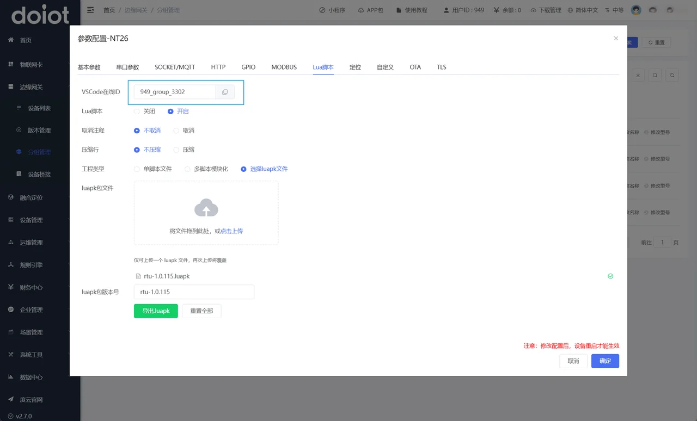

   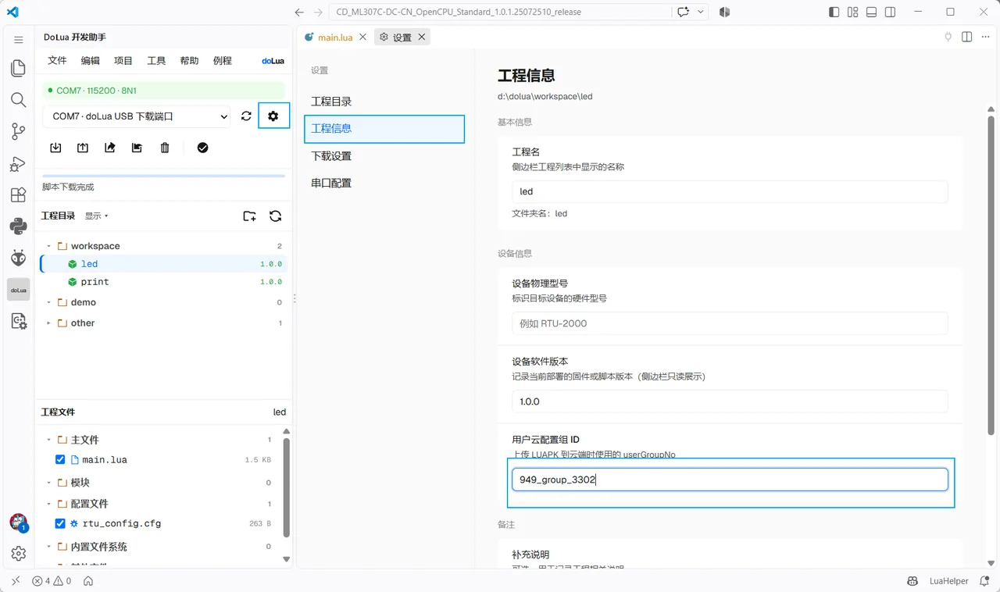

   注意这个 `id` 绑定的是工程，比如我这里配置的是 `led` 这个工程的云平台组 `id` ，则是只针对该工程生效，其他工程还需要再手动设置，不同的设备可以使用不同的组 `id`，上传到不同的分组中，对应不同的设备。

   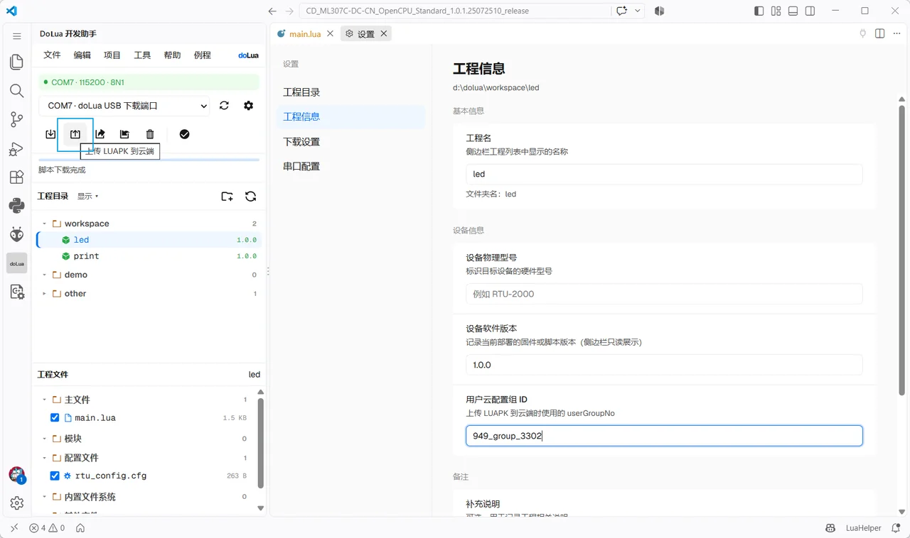

   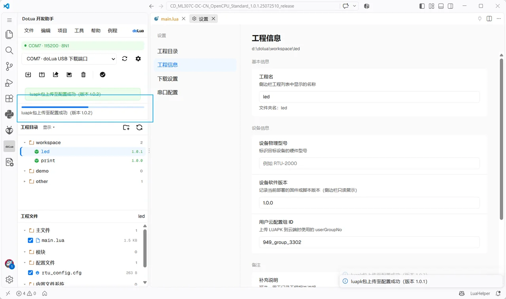

   可以注意到，点击上传时，设备版本号会自增，这是默认开启的，如果不需要版本号自增可以手动关闭，但是注意的是，如果使用云端下载，版本号不变时，设备不会拉取最新的`.luapk`，就是只认版本。

   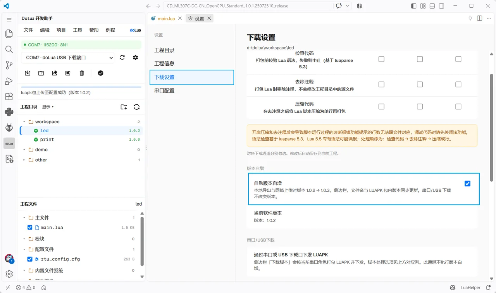

   文件上传完毕，复位设备就能更新最新固件。设备启动阶段会自动向服务器获取固件包，**采用云端更新时，设备必须正常联网**。

   如果正常，则串口会有如下的输出

   ```ini
   
   ECRDY
   
   +VERSION: "NT26-PRO-RTU-D1.2.27"
   
   +SIM: 2,"READY"
   
   
   hello world 	#旧脚本的输出
   
   
   +NET: "REGISTERED"  #设备驻网成功
   
   +WEBCONFIG: "START" #开始拉取最新固件
   
   +WEBCONFIG: "END"	#拉取固件结束
   
   +CONFIG_RESET: "AT+LUAPK" #有luapk更新，开始计划复位
   ```

   如果设备没有更新固件，则需要查看设备是否正常联网，可以通过发送AT指令来查询。

   ```ini
   
   AT+ISLINK
   
   +ISLINK: 1  #返回1，则代表这个设备能够联网,通常只看这个就够了
   
   OK
   
   AT+CEREG
   
   +CEREG: 1  #如果无法联网，还可以看下CEREG的返回结果，1和5为注册成功，2未注册，3被拒绝，4未知，
   
   OK
   
   AT+CSQ
   
   +CSQ: 20,99 #还可以查询下信号
   
   OK
   
   AT+ICCID
   
   +ICCID: "898604B41625D0023106" # 如果查询不到ICCID，说明设备没有插入SIM卡，或者硬件未识别到卡，此时必然是无法联网的
   
   OK
   ```

   主要检查 SIM 卡和天线。

2. 也可以手动选择导出的 .luapk

   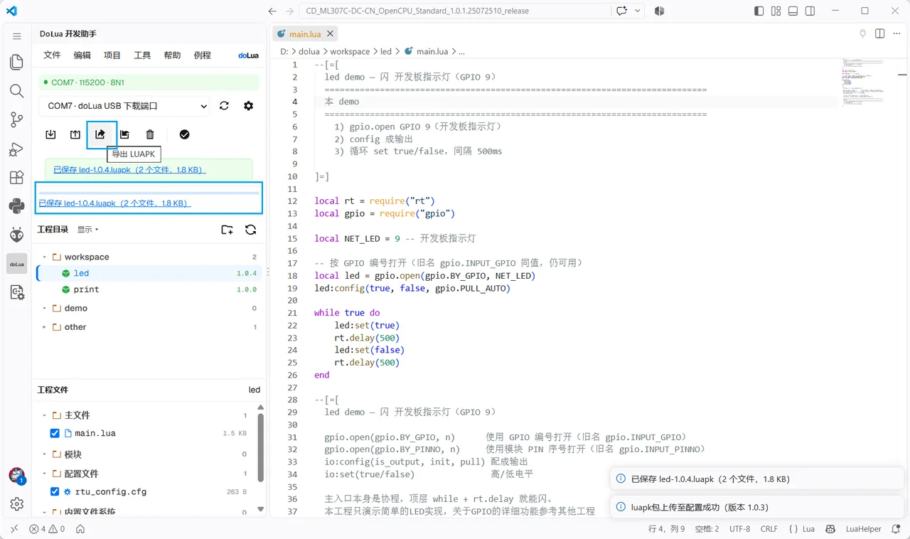

   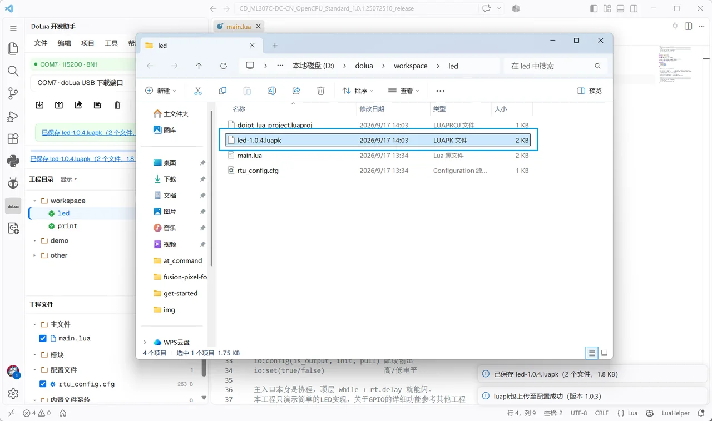

   云平台选择导出的 .luapk

   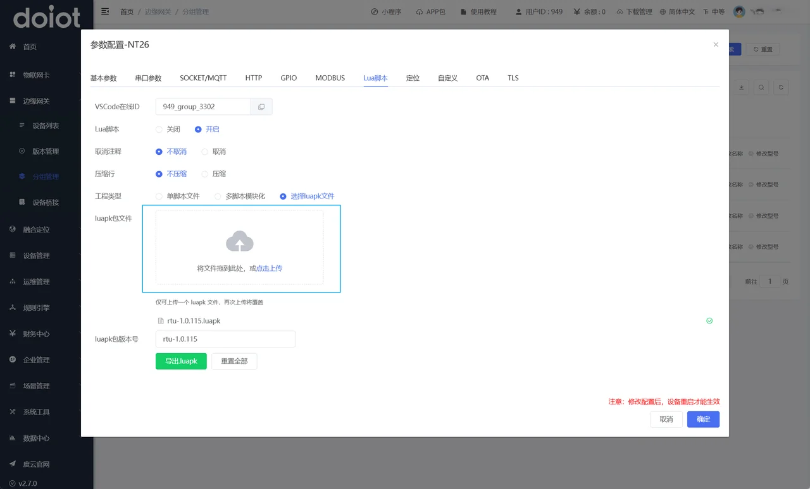

   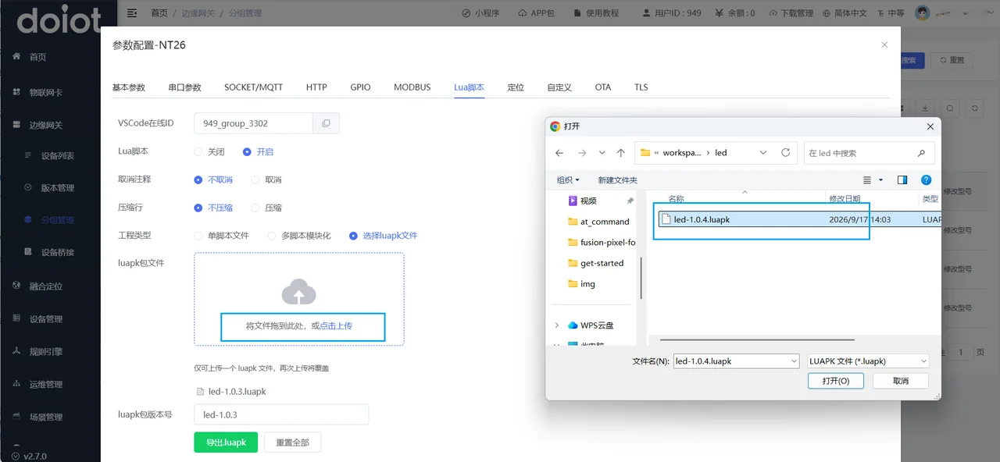

   之后复位设备即可。

注意：

- 设备必须能驻网。未插卡、未注册上的模组拉不到云端包。
- 云端改的是平台上的包与分组配置，不是你电脑上的工程文件夹；**本地改完要再上传一次**。

## 本地导出与还原

本地导出备份：插件可把当前工程写成 `工程名-版本.luapk`。**把 `.luapk` 拖进侧边栏工程目录即可还原成可编辑工程。**

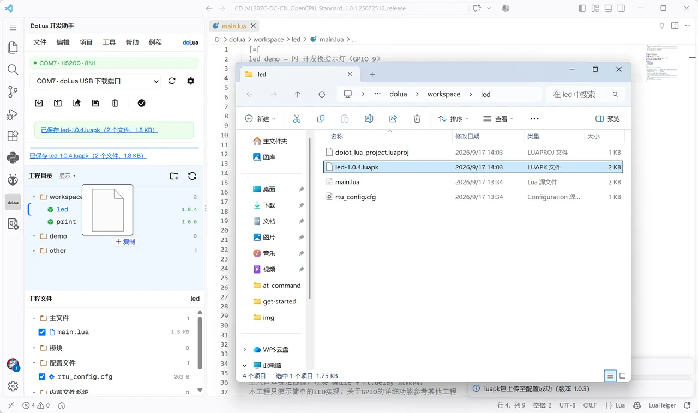

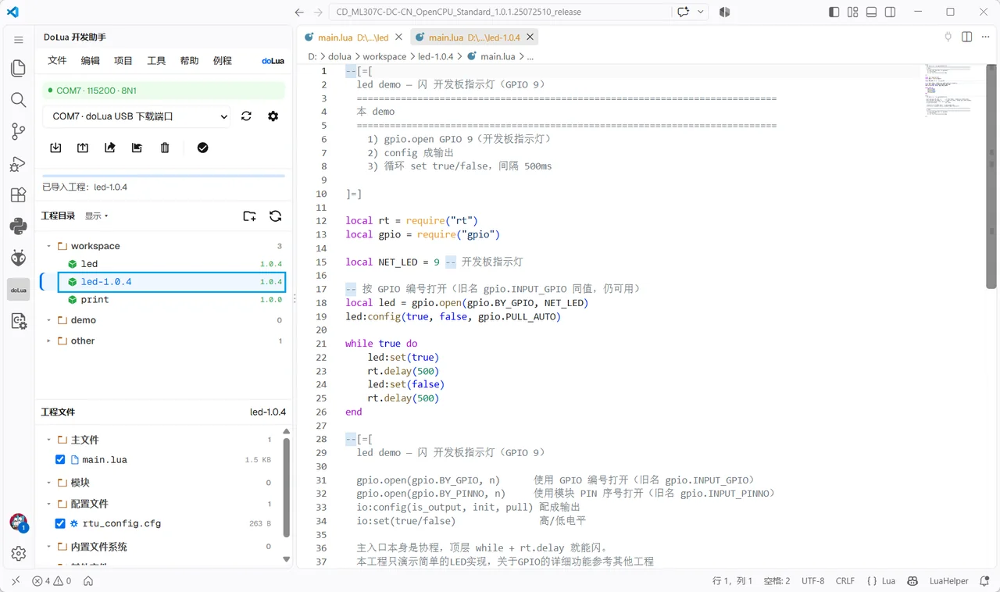

如果您在开发 `doLua` 时遇到问题，可以截取代码询问我们，也可以直接导出成 `.luapk `文件，发到客服群里询问技术支持。

---

[← 开始使用](get-started.md) · [工程形态 →](project.md)
