# 开始使用

**文档版本** `1.0.1`

这是 **doLua** 的入门教程。我们先搞懂 **doLua** 是什么、能干哪些事，接着装好配套开发工具，新建第一个工程，最后把脚本下载到设备（比如 NT26 PRO）里运行。

至于设备底层运行原理、资源配额、各类模块参数，本篇就不细讲了。如果后续需要了解，再去看 [doLua 核心](../nt26/core/README.md) 和 [API 索引](../nt26/api/README.md) 这两份文档。

当前公开型号：**NT26**（含 NT26 PRO）。下文以该型号当前固件为准。

---

## 目录

- [一、框架介绍](#一框架介绍)
- [二、doLua 核心主要特点](#二dolua-核心主要特点)
- [三、快速入门 & 环境搭建（新手首选）](#三快速入门--环境搭建新手首选)
  - [3.1 doLua 开发工具下载方式](#31-dolua-开发工具下载方式)
  - [3.2 开发工具安装教程](#32-开发工具安装教程)
  - [3.3 构建你的第一个 doLua 工程](#33-构建你的第一个-dolua-工程)
  - [3.4 下载程序的几种方式](#34-下载程序的几种方式)
- [四、doLua 工程形态详解](#四dolua-工程形态详解)
- [五、doLua 开发工具完整使用指南](#五dolua-开发工具完整使用指南)
- [六、进阶原理：消息框架与系统调度](#六进阶原理消息框架与系统调度)
- [读完去哪里](#读完去哪里)
- [修订记录](#修订记录)

---

## 一、框架介绍

### 1.1 什么是 Lua

Lua 是一门轻量级脚本语言，语法简洁，很适合嵌入到设备固件里。doLua 底层用的是 Lua 5.5，语法、table、函数、协程这些特性，都和标准 Lua 保持一致。

在本平台上要注意两件事：

| 有 | 没有 |
| --- | --- |
| 基本库、`package`（因而可以 `require`）、`coroutine`、`string`、`table`、`math`、`utf8`、`debug` | `io`、`os` |

没有 `io` / `os` 是刻意的：设备上没有电脑那种 POSIX 文件和进程模型。内部短对象走内部存储，大文件走字节存储或外挂盘，时间与复位走系统模块。不要写 `io.open`、`os.execute`。

`print(...)` 是语言内置。在本平台它接到模块串口（默认 **UART1**），**不是**电脑终端窗口。

### 1.2 什么是 doLua

doLua 是成都度云未来科技有限公司模组上，跑在设备端的 Lua 运行环境。 你可以编写脚本工程，用来驱动外设、联网、读写存储，调用各类系统能力。

一句话：一台设备、**一个脚本虚拟机**、协作式多任务。你写业务（闪灯、采数、上报、存盘）；驻网、协议栈、看门狗、AT 通道由固件其它部分负责。

更完整的定位见 [什么是 doLua](../nt26/core/what.md)。

### 1.3 内置集成模块 & 核心能力

内置（平台预加载）模块已经打包在固件里，直接用 `require("模块名")` 就能加载，不需要自己写源码。 覆盖运行时、外设、屏幕、网络、存储、协议工具六大类，提供 IO、串口、网络上云、文件存储、Modbus、TLS 等物联网常用能力，用来开发设备业务。

| 类别 | 典型模块 | 能做什么 |
| --- | --- | --- |
| 运行时 | `rt`、`sys`、`log`、`script`、`info` | 任务与延时、系统选项、日志、查脚本版本、读 IMEI 等本机信息 |
| 外设 | `gpio`、`uart`、`spi`、`i2c`、`soft_i2c`、`pwm`、`adc`、`charge` | 灯与按键、串口、总线、PWM、ADC、充电检测 |
| 显示 | `lcd`、`lvgl` | 屏驱、简易 UI |
| 网络 | `tcp`、`http`、`mqtt`、`dns`、`ntp`、`lbs`、`rndis`、`wifiscan`、`sms` | 连接、上报、对时、定位、USB 网卡、扫热点、短信 |
| 存储 | `ufs`、`ublob`、`lfs`、`flashdb`、`sfud` | 内部短对象 / 字节文件、外挂 Flash 文件树与 KV |
| 协议与工具 | `json`、`hex`、`modbus`、`framekit`、`rtu`、`tls`、`nmea`、`gps`、`cron`、`lp` | 编解码、工业协议、TLS、定位语句、日程、低功耗 |
| 配置（不是 `require`） | 工程里的 `rtu_config.cfg` | 开机解析串口、映射、业务开关；见 [rtu_config](../nt26/api/rtu_config/rtu_config.md) |

---

## 二、doLua 核心主要特点

DoLua 是设备端 Lua 5.5 运行时，单设备独立虚拟机，支持协作式多任务，回调跑在调度循环，Lua 与 AT 指令可共存，工程打包为 LUAPK 多渠道下发，资源隔离，适配多种物联网场景，配套 VS Code 等编辑器开发助手。

---

## 三、快速入门 & 环境搭建（新手首选）

目标：装好插件 → 建一份最小工程 → 下载到模组 → 在串口看到 `hello world`。

准备：

- 一台支持 dolua 的设备，比如 NT26 / NT26 PRO（度云 doLua 固件）
- 数据线（能传数据，不要只用充电线）
- Windows 10 / 11 电脑（当前开发工具主要在此验证）
- 编辑器三选一：**Cursor**、**Visual Studio Code**、**Trae**

### 3.1 doLua 开发工具下载方式

开发工具是编辑器扩展 **dolua 开发助手**，不是单独的桌面 IDE，而是一个 vscode/cursor/trae 插件。

下载路径：https://dolua.cn/plugins 


### 3.2 开发工具安装教程

#### 第 1 步：安装编辑器

已有 Cursor / VS Code / Trae 可跳过。三者都能装同一类 VSIX；命令和侧边栏位置略有差别，以你用的那款为准。

#### 第 2 步：安装扩展

安装方式有两种，一种是手动拖放到模块区即可安装。

下方为 vscode 的演示


下方为 cursor 的演示


cursor 的布局导致他容易被折叠到下拉栏里，点击展开找到插件，并把它锚定在主界面，然后把左侧栏拉宽一点即可常驻

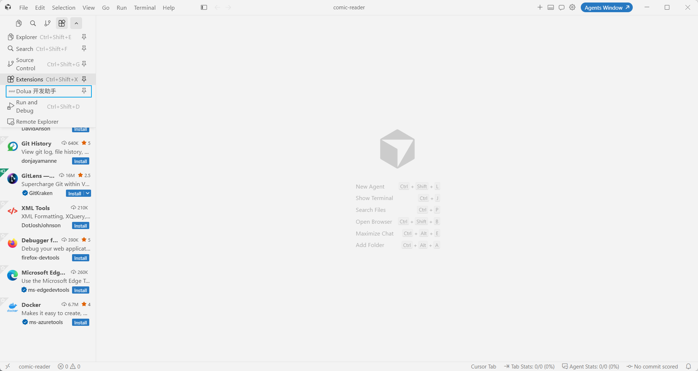

另一种安装方式，如果你已经通过上面的方式安装则可以跳过这段

1. 打开命令面板（Windows：`Ctrl+Shift+P`）。
2. 执行「从 VSIX 安装…」/ `Install from VSIX…`。
3. 选刚下的 `.vsix`，装完后重载窗口。

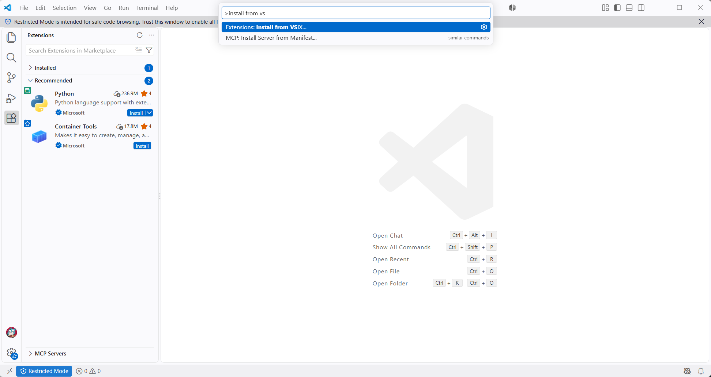

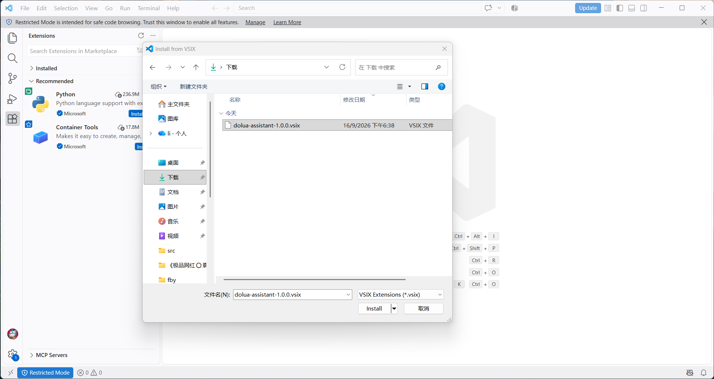

无论你用哪种方式下载，最后都可以找到我们的插件

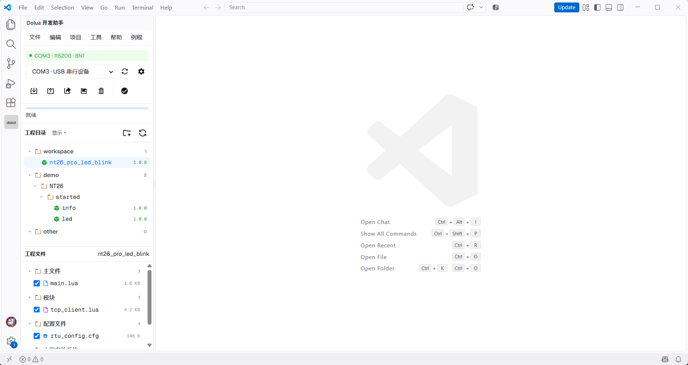

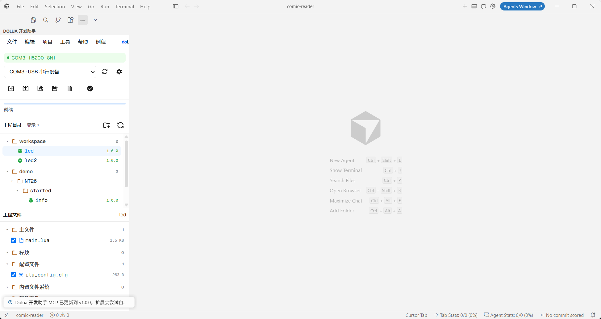

#### 第 3 步：设置 Lua 工作目录

侧边栏的 **Lua workspace**（以及 demo 根）是 **工程仓库**：下面可以放很多个工程，每个工程是单独一层文件夹。这一步是在插件里指定仓库路径，不是让你把整个仓库根当成一份工程，一定不要直接在这个根目录下放工程文件。

可以：../workspace/project/main.lua

不要：../workspace/main.lua

建议：

1. 在磁盘上建一个空目录，例如 `D:\doLua\workspace`。
2. 在侧边栏把 **Lua workspace** 指到这个目录。
3. 需要官方示例时，再设 **demo** 目录（或稍后从例程中心导入）。

【图片】

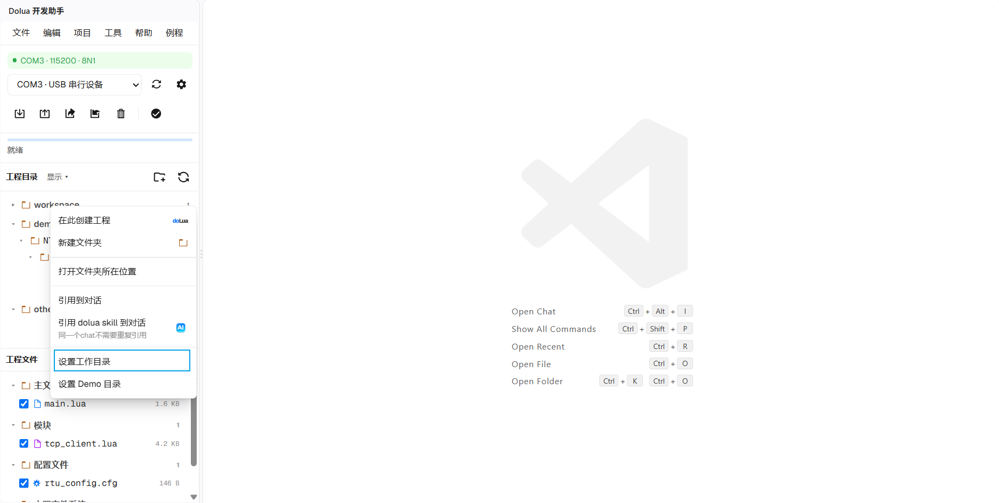

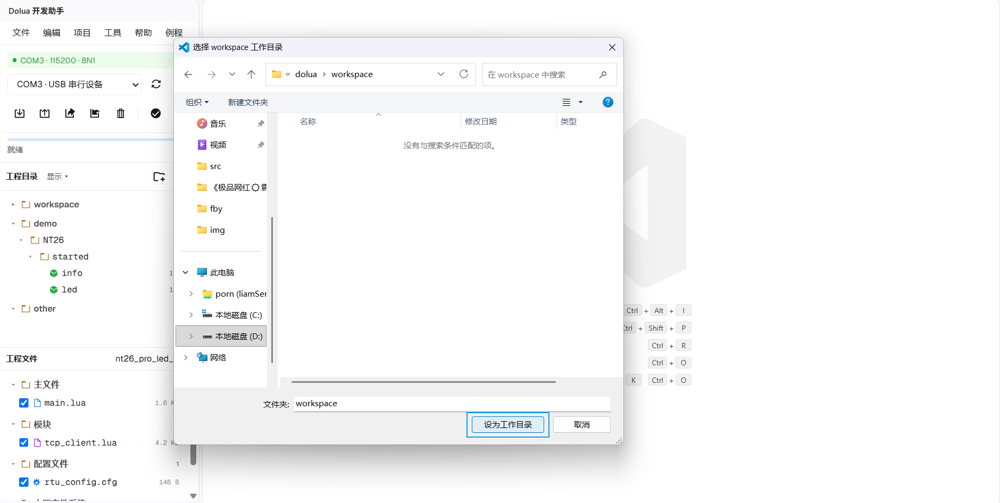

设置完成后，扩展会在该目录写入编辑器所需的助手配置（规则、技能说明等）。工作目录里暂时没有子工程是正常的。

#### 第 4 步：USB 口与 串口

USB 口：

模组用 USB 连上电脑后，设备管理器里通常会出现两路 CDC 虚拟串口（名称以当时固件描述符为准）：

| 口 | 描述符（当前固件） | 干什么 |
| --- | --- | --- |
| USB AT | `Doiot USB AT` | 发 AT、看部分日志；也可以切到下载协议下脚本 |
| USB DOWNLOAD | `Doiot USB Download` | **专职下 LUAPK**，不占 AT 会话 |

注意事项：

- 必须用数据线。口出不来时换线、换 USB 口，模块供电要稳（USB 供电不稳会乱重启）。
- Windows 10/11 一般能直接枚举 CDC。若显示未知设备，按官网驱动说明安装后再看。
- UART 下载另需 USB 转串口接到模组 **UART1**（丝印 `MAIN_TXD` / `MAIN_RXD`，模块 PIN 18 / 17）。出厂波特率常见 **115200 8N1**。
- 不要同时用两路去抢同一轮下载：USB AT、USB DOWNLOAD、UART **同时只允许一路**占用下载引擎。

串口：

设备通常有多路物理串口，需要用户自己使用USB TTL设备连接模块，如果是开发板，则可以使用板载的接口，通常如下：

| 口                   | 描述符                        | 干什么        |
| -------------------- | ----------------------------- | ------------- |
| 连接的设备 MAIN UART | `USB-Enhanced-SERIAL-A CH342` | 发 AT，看 LOG |
| 连接的设备 UART2     | `USB-Enhanced-SERIAL-A CH342` | 发 AT，看 LOG |

最好一定得有一路连接到 MAIN UART 的设备，这是主流的输出手段，dolua 的 print 和 log ，也是默认路由到 MAIN UART 的，当然这个映射也是可以改的，可以输出到其他串口，和 USB AT。

### 3.3 构建你的第一个 doLua 工程

下面用最小脚本验证链路

#### 第 1 步：新建工程文件夹

在插件侧边栏对 **workspace** 执行新建工程，文件夹名例如 `hello`。插件会在仓库下再创建一层目录，并写入：

```
hello/                          ← 工程根（含 luaproj 的这一层）
  doiot_lua_project.luaproj     ← 工程标志，插件只认这个文件
  main.lua                      ← 默认主文件
  rtu_config.cfg                ← 默认配置（可选）
```

不要把 `main.lua` 直接放在 workspace 根目录。

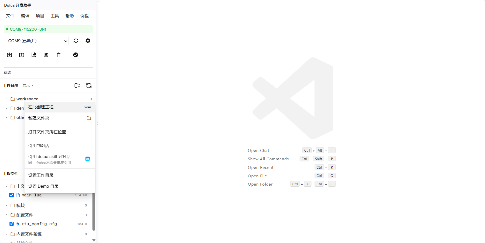

新建工程对话框（文件夹名 `hello`）

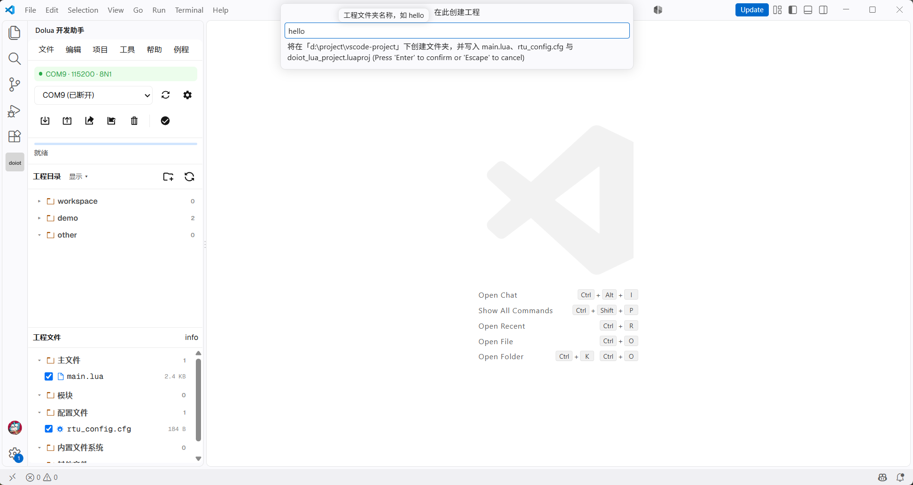

侧边栏出现 `hello` 工程，下半「工程文件」已分五区

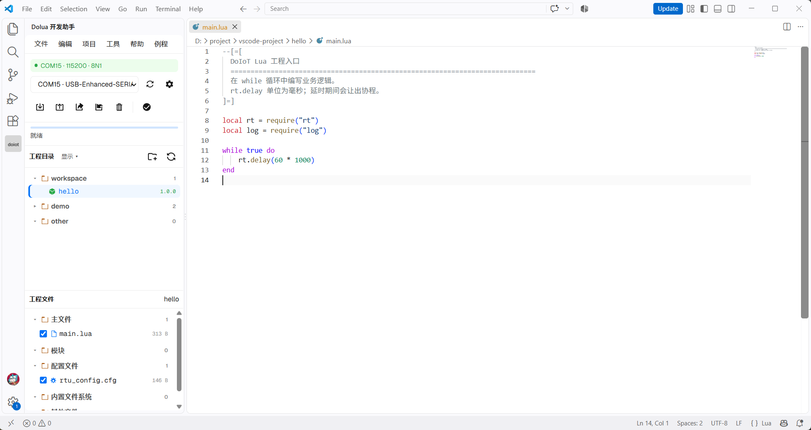

也可以从例程中心导入 `started/hello`，效果相同。

#### 第 2 步：写入口脚本

打开工程里的 `main.lua`，加上一行输出：

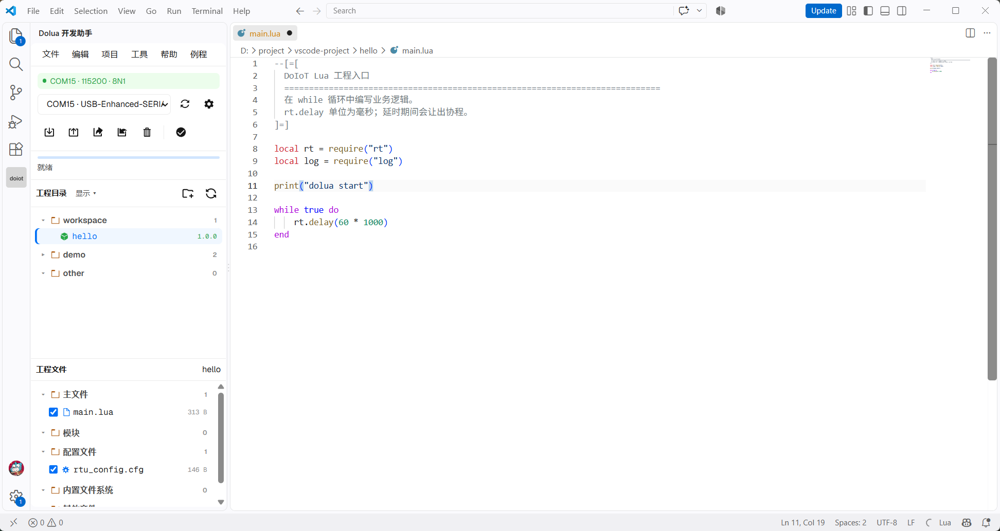

```lua
local rt = require("rt")

while true do
    print("hello world")
    rt.delay(60*1000)
end
```

要点：

- `require("rt")` 是平台模块，工程里不用自备 `rt.lua`。
- 入口脚本本身就是一条协程，顶层可以直接 `rt.delay`。
- `rt.delay(1000)` 让出 1 秒，其它任务和回调才有机会跑；不要写成从不让出的空转死循环。
- `print` 默认出 **UART1**。若只插了 USB、没接主串口，把配置里的 `print_route` 改成 `usb_at`（见下一步），或用 USB 转串口接 UART1。

`rtu_config.cfg` ：

```ini
[lua]
print_route=uart1
log_route=uart1
```

把 `print` 打到 USB AT 口时改为 `print_route=usb_at`。改配置后要重新下载，复位后生效。

如果你本就用的物理串口1则不用改。

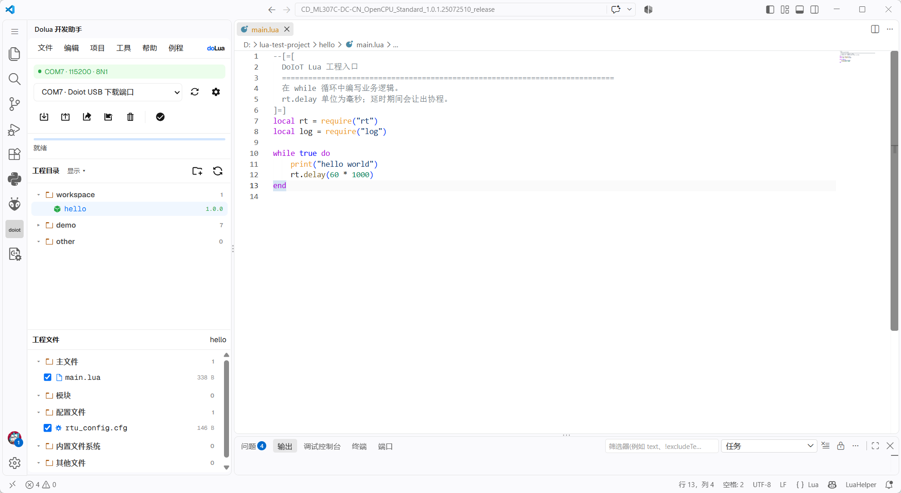

#### 第 3 步：**下载并看输出**

选择下载口，点击下载按钮开始下载

USB DOWNLOAD / USB AT / UART COMx【必须是连接设备的串口】 都是可以作为下载口的。 

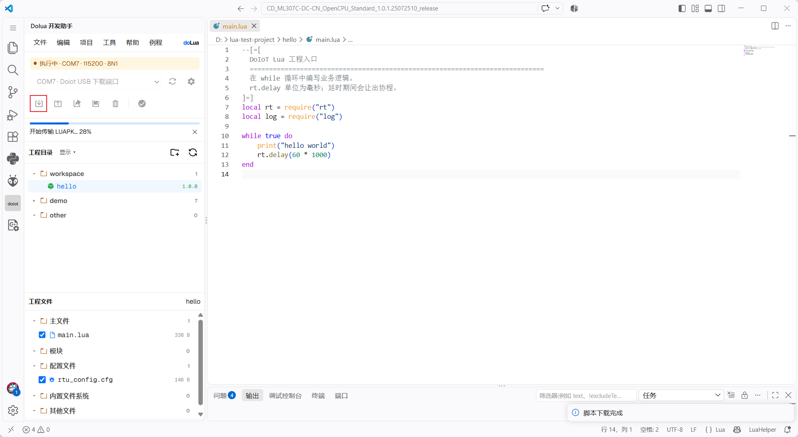

之后点击设备的RESET按钮，复位设备【如果板子没有留出，则可以重新上电】

用串口工具打开 **UART1**（115200 8N1）或你配置的 `print_route`，应每隔约 60 秒出现：

```
hello world
```

> 关于+VERSION,+SIM 等log，是 RTU 输出，如果不需要是可以用配置进行关闭。

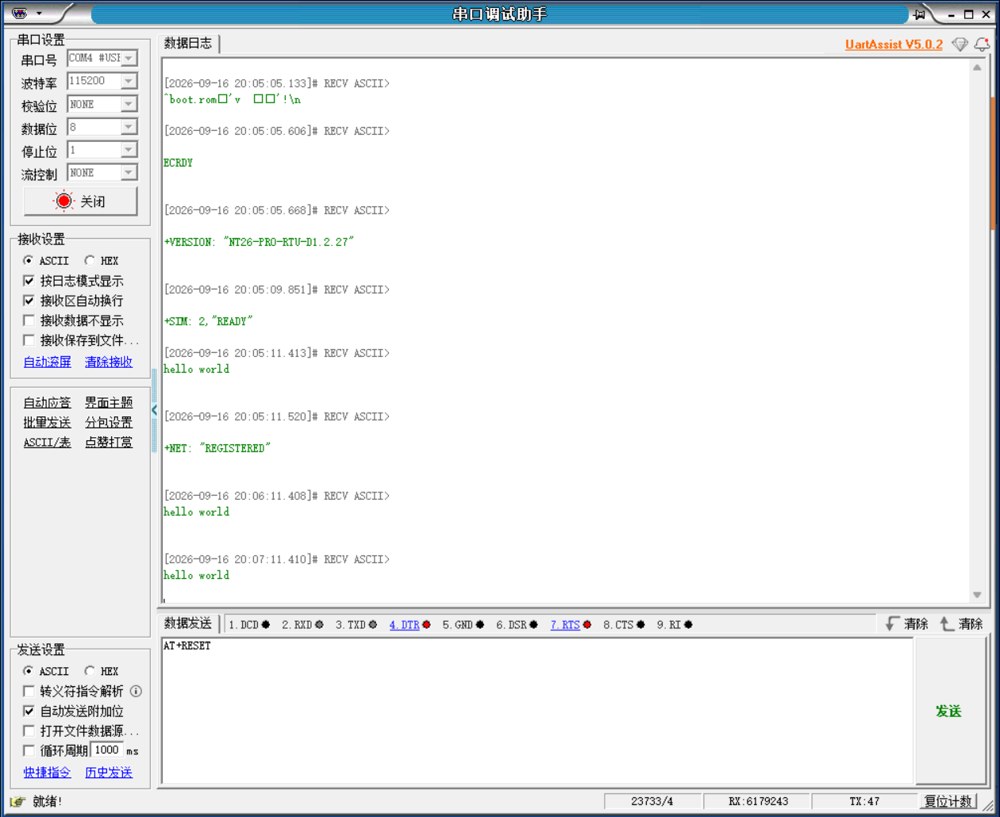

串口输出循环打印 `hello world`

常见问题：

| 现象 | 先查 |
| --- | --- |
| 找不到口 | 线材、供电、驱动、是否进错 USB 口 |
| 下载失败 / 忙碌 | 是否另一路已经在下；关掉占用该 COM 的其它串口助手 |
| 下载成功但没有 `hello world` | `print` 走 UART1，USB AT 上看不到；改 `print_route` 或改接主串口 |
| 乱码 | 波特率不是 115200，或接的是调试口 UART0 却按 UART1 参数开 |
| 脚本没换 | 未复位；或勾选里没有主文件 |

### 3.4 试试例程中心的例程

点击例程->入门->info->下载到workspace

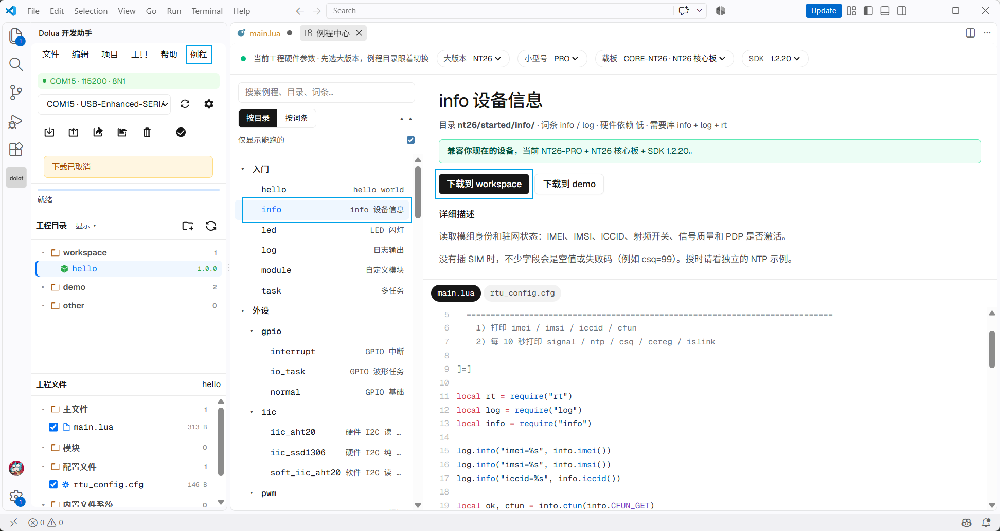

双击工程  info 或者选中 info 后点击下方的 mian.lua 则能展开这个工程的 main 文件。

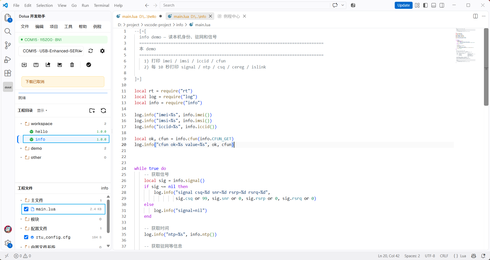

### 3.4 关于下载方式

#### USB DOWNLOAD（推荐日常）

- 对应虚拟串口 **Doiot USB Download**。
- 专职走下载协议，不占用 USB AT 上的 AT 会话。
- 适合：USB 已枚举出两路口、边下脚本边还要用 USB AT 发指令或看日志。

#### USB AT

- 对应 **Doiot USB AT**。平时是 AT 口；下载时由插件切到同一套打包传输协议，结束后回到 AT。
- 适合：主机只看到一路 USB AT、或必须从 AT 口下包。
- 注意：下载过程中不要用同一口再发 AT；空闲超时后设备会自行退回 AT。

#### UART 口

- 接到业务串口，默认 **UART1**（`MAIN_TXD` / `MAIN_RXD`，PIN 18 / 17）。出厂常见 115200 8N1。
- 插件在该口切到下载协议，结束后回到 AT。
- 适合：没有 USB、夹具只引出主串口、工装电脑只有转串口芯片。
- 该口若同时跑 AT 调试，下载期间会被插件占用；下载结束后再开串口助手。

#### 云平台上传代码

适合设备已经驻网、不在手头、要远程换脚本，和正式生产批量下载。

典型路径：

1. 本地工程在插件里点 **上传到云端**（需要在线 id）。

   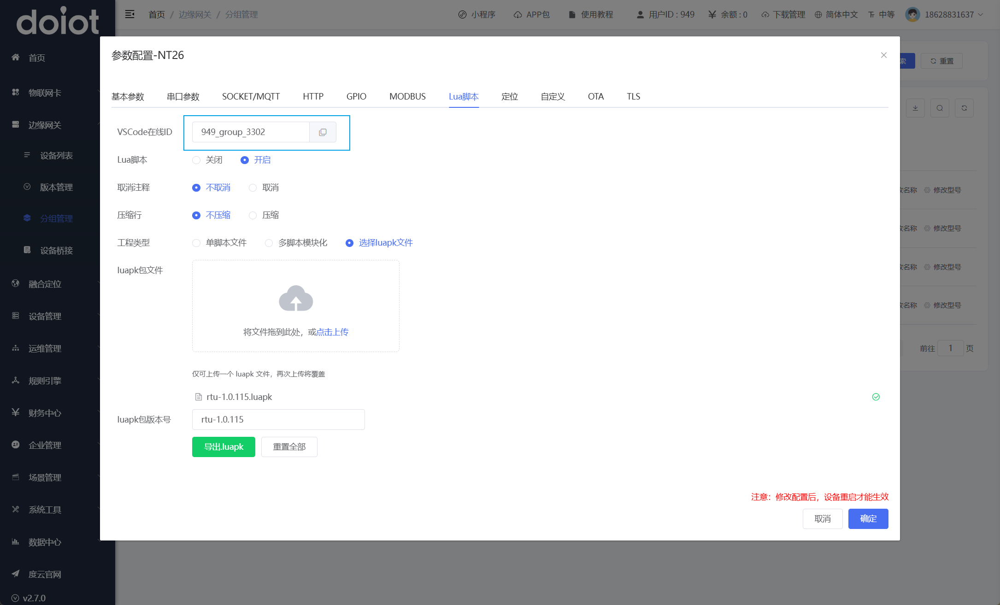

   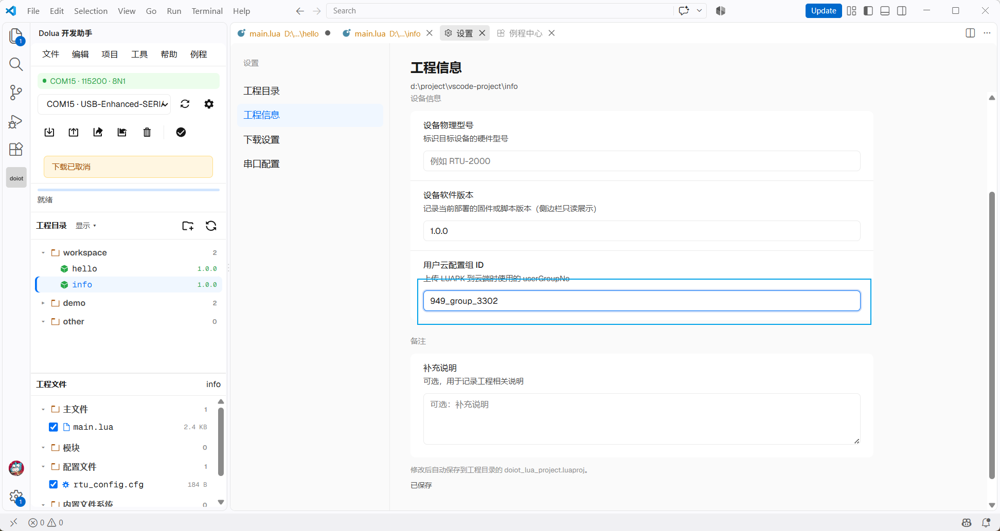

   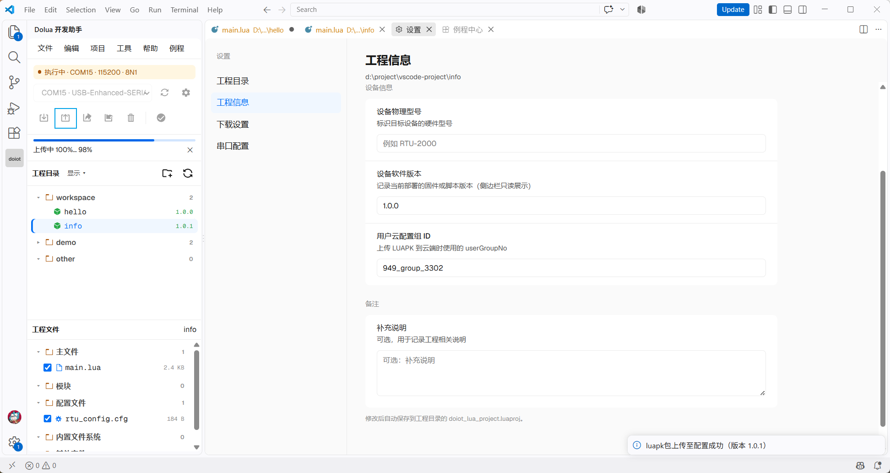

   之后复位设备即可。

2. 也可以手动选择导出的 .luapk

   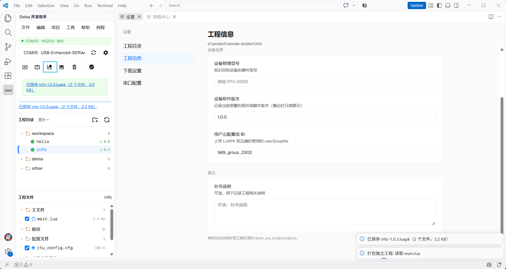

   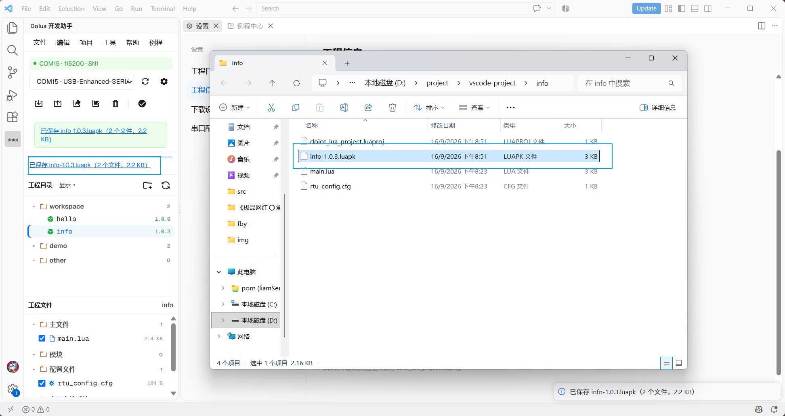

   云平台选择导出的 .luapk

   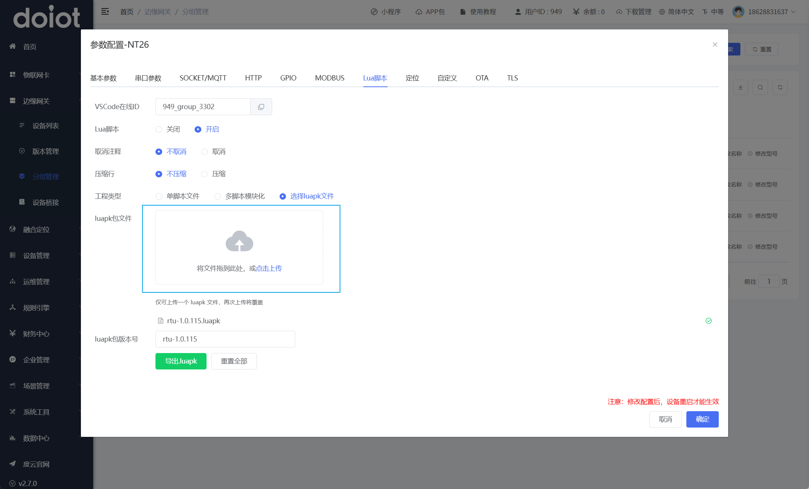

   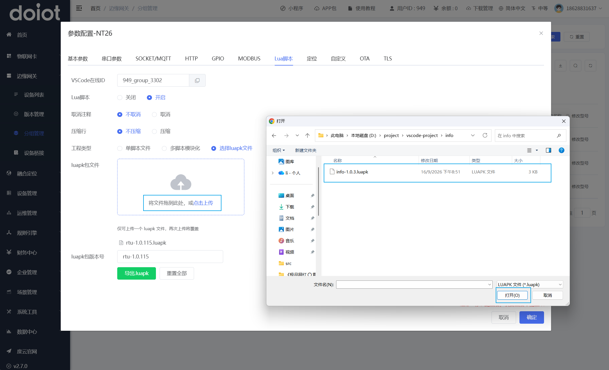

   之后复位设备即可。

注意：

- 设备必须能驻网。未插卡、未注册上的模组拉不到云端包。
- 云端改的是平台上的包与分组配置，不是你电脑上的工程文件夹；**本地改完要再上传一次**。

本地导出备份：插件可把当前工程写成 `工程名-版本.luapk`。把 `.luapk` 拖进侧边栏工程目录即可还原成可编辑工程。

---

## 四、doLua 工程形态详解

侧边栏规则的全文见 [工程结构](../dolua-assisant/project-structure.md)；设备上这份包怎么跑见 [工程与脚本包](../nt26/core/project.md)。

### 4.1 本地工程：仓库、文件夹、五区

**仓库 ≠ 工程。** workspace / demo 根是仓库；含 `doiot_lua_project.luaproj` 的那一层才是工程。

```
workspace/                      ← Lua workspace，不要在这里摊 main.lua
  hello/
    doiot_lua_project.luaproj
    main.lua
    rtu_config.cfg
  led_blink/
    ...
```

【图片】侧边栏上半「工程目录」多份工程，下半「工程文件」五区

| 分区 | 典型文件 | 进不进 LUAPK |
| --- | --- | --- |
| 主文件 | 只能 1 个，几乎总是 `main.lua` | 必须进，作为虚拟机入口 |
| 模块 | 你的 `.lua` | 已归入模块区的才进；未登记的设备上 `require` 不到 |
| 配置 | 如 `rtu_config.cfg`，可多份 | **只带当前选中的那一份**，烧录时以固定名写入设备 |
| 内置文件系统 | 图片、字库、清单等 | 已勾选且选了存储位置（`ufs` / `blob`）的才进，占内部约 220 KB 配额 |
| 其他 | README、原理图 | **默认不进包、不烧录** |

`doiot_lua_project.luaproj` 是身份和分区账本（显示名、型号、主文件、模块列表、勾选等）。**不要手改这份 JSON** 来改分区或勾选，用侧边栏操作，否则界面可能把改动盖掉。

扫描规则：从上往下走文件夹树，某一层出现描述文件就记成一个工程，**不再进入它的子目录找工程**。因此不要在工程里面再套一份 `luaproj`。

用户模块三件事必须同时成立：

1. 文件在工程里，且登记在模块区。
2. `require` 的名字 = 文件名去掉 `.lua`。
3. 文件末尾 `return` 一张表。

```lua
-- led.lua（须登记为模块）
local M = {}
function M.on() end
return M

-- main.lua
local led = require("led")
led.on()
```

个数上限 **35**、名字最长 **31** 字符。不要用 `gpio`、`rt`、`mqtt` 这类平台名当用户文件名。

配置文件 **不是** Lua 模块，不能 `require("rtu_config")`。语法见 [rtu_config.cfg](../nt26/api/rtu_config/rtu_config.md)。

### 4.2 打包格式：LUAPK

**LUAPK**（Lua Update Package，扩展名 `.luapk`）是由当前工程生成的可烧录包。

包内会带：主文件、模块区 `.lua`、当前选中配置、已勾选且选了 `ufs`/`blob` 的内置文件。其他文件和 `doiot_lua_project.luaproj` 本身不进包。

设备侧大致是：收完整包 → 校验 → 解压写入脚本区（及配置、内置文件）→ 复位或按固件启动路径重建虚拟机。当前未启用双槽切换，不要按「写到空闲槽再试跑」规划发布。

三道体积闸门不要混【该数据只针对当前的NT26-PRO】：

| 闸门 | 卡的是 |
| --- | --- |
| 整包约 260 KB | 一次传输能不能收完 |
| 共享约 220 KB | 解压落盘后脚本 + 内部文件能不能写下 |
| 堆约 700 KB | 跑起来之后 |

发布建议：

1. 本地跑通 `hello` / 业务工程。
2. 导出一份 `.luapk` 留底。
3. 产线用 USB DOWNLOAD 或 UART 工装下发；已部署设备用云端上传。
4. 用 `ATI`、脚本 AT 或 `require("script").info()` 核对版本。

【图片】导出本地 `.luapk` 文件

【图片】把 `.luapk` 拖进侧边栏还原工程

---

## 五、doLua 开发工具完整使用指南

### 5.1 工作目录

| 目录 | 建议放什么 |
| --- | --- |
| Lua workspace | 你自己的业务工程 |
| demo | 官方例程、临时试验 |
| 其它 | 只浏览、不默认写入的目录 |

注意一定要被选中的文件才会被下载哦，如果一个文件暂时不需要下载，可以先不勾选。


### 5.3 工程日常操作-【太累了，先写到这儿，后面接着完善】

| 操作 | 做法 |
| --- | --- |
| 新建 | 侧边栏对仓库「新建工程」，输入文件夹名 |
| 打开 | 点工程名；下半五区跟着切到该工程 |
| 改分区 | 把文件移到主文件 / 模块 / 配置 / 内置 / 其他；模块必须登记才能 `require` |
| 勾选下载 | 只勾要进包的文件。其他区默认不勾 |
| 选配置 | 多份 `*.cfg` 时单选一份作为烧录配置 |
| 内置文件 | 勾选后还要选 `ufs`（可序列化 Lua 值）或 `blob`（二进制 / 字符串） |
| 工程信息 | 显示名、软件版本等写在描述文件里，用插件提供的工程信息入口改 |
| 关闭 / 隐藏 / 删除 | 用插件命令。删描述文件后源码还在，但不再当工程管理 |
| 重命名 | 改文件夹名也走插件，避免描述文件和磁盘脱节 |

### 5.4 例程中心

侧边栏「例程」默认对接 [http://dolua.cn/market](http://dolua.cn/market)。导入后得到完整工程（`main.lua`、`manifest.json`、`luaproj`），不要从零手写第一份脚本去试接口。

推荐路径与 [示例索引](../../examples/nt26/README.md) 一致：`started` → 对应模块 → `apps` 场景。

【图片】例程中心列表与「导入到 workspace」

### 5.5 连接、下载、日志

1. 插上 USB 或接好 UART1。
2. 选对端口。日常脚本：**USB DOWNLOAD**。
3. 确认勾选包含主文件（及需要的模块、配置）。
4. 下载；必要时复位。
5. 看脚本输出：
   - `print` → `[lua] print_route`（默认 UART1，可改 `usb_at`）
   - `log.*` → `[lua] log_route`，与 print 独立
   - 系统 / AT 日志另有输出口，不要和 Lua `print` 混成一个窗口就以为脚本没跑

【图片】下载口、勾选列表、开始下载

串口助手也可用网页工具 [https://uart.doiot.cn/](https://uart.doiot.cn/) 做 AT 确认（例如 `ATI` 看是否为度云固件）。

下载失败优先查：口被占用、三路抢下载、包太大、内部配额满、线材供电。

### 5.6 打包与备份

| 动作 | 结果 |
| --- | --- |
| 下载到设备 | 生成 LUAPK 并传输 |
| 上传云端 | 生成 LUAPK 再上传 |
| 导出到本地 | 写成 `工程名-版本.luapk` |
| 导入 LUAPK | 解回工程文件夹 + 描述文件 |

### 5.7 用 AI 改工程（可选）

在 Cursor / VS Code / Trae 里启用 MCP 服务器 **Dolua 开发助手** 后，对话里的助手可以直接在 **当前 Lua workspace** 里建工程、写 `main.lua`、登记模块、做语法初筛。

要点：

1. 命令面板 `MCP: List Servers`，该服务器为 Running。
2. **新开一轮对话** 再让助手写代码（旧对话可能还没有工具）。
3. 先在侧边栏设好 workspace，不要让助手往编辑器工作区根摊 `main.lua`。

【图片】MCP: List Servers 中 Dolua 开发助手为 Running

这不是必选项。不开启时，用侧边栏和编辑器照样能完成全部烧录流程。

### 5.8 常用注意

- 改完 Lua 后，以设备上跑起来的为准；电脑上能打开的 `.lua` 若没进模块区，设备 `require` 会失败。
- 不要把平台模块实现成同名用户文件。
- 布尔参数写真 / 假。走布尔语义的接口里，数字 `0` 往往是「真」。
- 接外部硬件先读 [硬件脚位](../nt26/hardware/README.md)，再打开当前产品那一篇（NT26-PRO 为 [pro.md](../nt26/hardware/pro.md)）。
- 日常等待用 `rt.delay`。不要用 `sys.delay_ms` 当循环延时。

---

## 六、进阶原理：消息框架与系统调度

**【新手提示】** 本节是框架底层原理。第一次只要会 `print` + `rt.delay` + 下载即可。等要写串口回调、MQTT、多任务时再读；全文见 [消息和调度](../nt26/core/schedule.md)、[doLua 是怎么运行的](../nt26/core/runtime.md)。

### 6.1 消息框架怎么跑

硬件中断、网络线程 **不会** 直接执行你的 Lua 函数。它们只把「发生了某事」丢进事件队列；脚本引擎线程上的调度循环再取出，唤醒某条协程，或调用你注册的短回调。

```
硬件 / 协议线程                 脚本引擎线程
──────────────                 ────────────
GPIO 边沿 ──┐
串口收包  ──┤
MQTT 报文 ──┼──► 事件队列 ──► 调度循环 ──► 唤醒某条协程
定时器到期 ─┤                      │         或 调用短回调
信箱投递  ──┘                      │
                                   ▼
                            同一时刻只跑一条 Lua
```

因此：

- 回调期间占用整条调度，必须马上返回。
- 回调里不要 `rt.delay`、不要等信箱、不要同步 `mqtt:pub` / `wait_connect`。
- 正确做法：回调里 `rt.mbox_send(...)`，业务放在已经卡在 `rt.mbox_recv` 上的工作协程。

脚本自己传数据有两套：

| | 信箱 `mbox` | 队列 `mq` |
| --- | --- | --- |
| 模型 | 按主题广播 | 先 `create`，FIFO |
| 积压 | 当时没人听就丢 | 可以积压到深度上限 |
| 适合 | 回调 → 工作协程；多处同时要知道「发生了」 | 一对一、突发要按序拉空 |

主题名最长 **23** 字节，超长截断会撞车。事件队列深度当前 **128**；生产快于消费会满。

### 6.2 系统调度、执行流程、任务规则

上电后的简化链：

```
上电 → 固件初始化（驻网 / AT 可并行）→ 选定当前脚本
    → 建虚拟机（堆上限约 700 KB）→ 打开标准库、登记模块加载器
    → 把 main.lua 编译进入口协程并启动
    → 调度循环：直到没有可跑的任务且没有待处理事件
```

入口协程：

- `main.lua` **本身就是一条任务**，顶层可以 `delay` / 等消息。
- `rt.task_start(fn)` 再开一条；`fn` 碰到让出点后，`task_start` 才返回。
- 入口 `return` 只结束自己；其它还在等事件的任务可以继续。
- 全部协程结束且没有事件时，脚本生命周期结束。长期业务请留一条 `while true do rt.delay(...) end`。

任务槽大约 **16** 条（含入口第一次 delay 占用的那条）。软件定时器最多 **8** 路。

三种「等一会儿」不要混：

| 种类 | 其它 Lua 协程 | 典型用途 |
| --- | --- | --- |
| `rt.delay`（让出） | **能跑** | 日常等待 |
| `sys.delay_ms`（整线程睡眠） | **全停** | 仅短时序必须独占引擎时 |
| `sys.delay_us`（忙等） | 全停，核空转 | 仅极短脚线 |

推荐骨架（长期脚本）：

```lua
local rt = require("rt")
local log = require("log")

local function worker()
    while true do
        local ok, ev = rt.mbox_recv("events")
        if ok then
            log.info("ev")
            -- 业务只放工作协程
        end
    end
end

rt.task_start(worker)

-- 先启动接收任务，再注册外设 / 网络回调（回调里只 mbox_send）

while true do
    rt.delay(10000)
end
```

写脚本时的调度纪律：

1. 先有人等，再注册回调（否则头几条广播信箱会丢）。
2. 回调只投递。
3. 入口或至少一条任务必须周期性让出。
4. 网络客户端、打开的脚要被脚本一直持有，不要只活在临时局部变量里等着被回收。
5. 对象方法用冒号：`led:set(true)`，不要写成 `gpio.set(true)`。

---

## 读完去哪里

| 接下来 | 去这里 |
| --- | --- |
| 虚拟机、配额、存储怎么分 | [doLua 核心](../nt26/core/README.md) |
| 五区 / LUAPK 细则 | [工程结构](../dolua-assisant/project-structure.md) |
| 查 `require("…")` | [API 索引](../nt26/api/README.md) |
| 对原理图、选脚 | [硬件脚位](../nt26/hardware/README.md) |
| 应用 AT | [AT 索引](../nt26/at/README.md) |
| 抄可烧录工程 | [examples/nt26](../../examples/nt26/README.md) |

---

## 修订记录

| 版本 | 日期 | 说明 |
| --- | --- | --- |
| 1.0.0 | 2026-09-16 | 首版：开始使用（框架、特点、安装与第一份工程、下载通道、工程形态、工具指南、调度导读） |
| 1.0.1 | 2026-09-16 | 插件改为从 https://dolua.cn/plugins 下载 VSIX；标明暂未上架扩展市场 |
