# 开始使用

**文档版本** `1.1.0`

这是 **doLua** 的入门教程。我们先搞懂 **doLua** 是什么、能干哪些事，接着装好配套开发工具，新建第一个工程，最后把脚本下载到设备（比如 NT26 PRO）里运行。

至于设备底层运行原理、资源配额、各类模块参数，本篇就不细讲了。如果后续需要了解，再去看 [doLua 核心](../nt26/core/README.md) 和 [API 索引](../nt26/api/README.md) 这两份文档。

当前公开型号：**NT26**（含 NT26 PRO）。下文以该型号当前固件为准。

本分类已拆成几页，建议按顺序读：

| 文档 | 讲什么 |
| --- | --- |
| **本页** | 框架介绍、装插件、第一份工程、例程中心 |
| [下载与云端](download.md) | USB DOWNLOAD / USB AT / UART / 云平台上传 |
| [工程形态](project.md) | 仓库与工程、五区、LUAPK |
| [开发工具](tools.md) | 侧边栏日常操作：新建、分区、导出、配合 AI |
| [调度导读](schedule.md) | 消息框架与协作调度（进阶） |

---

## 目录

- [一、框架介绍](#一框架介绍)
- [二、doLua 核心主要特点](#二dolua-核心主要特点)
- [三、快速入门 & 环境搭建（新手首选）](#三快速入门--环境搭建新手首选)
  - [3.1 doLua 开发工具下载方式](#31-dolua-开发工具下载方式)
  - [3.2 开发工具安装教程](#32-开发工具安装教程)
  - [3.3 构建你的第一个 doLua 工程](#33-构建你的第一个-dolua-工程)
  - [3.4 使用例程中心](#34-使用例程中心)
- [下一步](#下一步)
- [读完去哪里](#读完去哪里)
- [修订记录](#修订记录)

---

## 一、框架介绍

### 1.1 什么是 Lua

Lua 是一门轻量级脚本语言，语法简洁，很适合嵌入到设备固件里。doLua 底层用的是 Lua 5.5，语法、table、函数、协程这些特性，都和标准 Lua 保持一致。

在本平台上要注意两件事：

| 有 | 没有 |
| --- | --- |
| 基本库、`package`（因而可以 `require`）、`coroutine`、`string`、`table`、`math`、`utf8`、`debug` | `io`、`os` |

没有 `io` / `os` 是刻意的：设备上没有电脑那种 POSIX 文件和进程模型。内部短对象走内部存储，大文件走字节存储或外挂盘，时间与复位走系统模块。不要写 `io.open`、`os.execute`。

`print(...)` 是语言内置。在本平台它接到模块串口（默认 **UART1**），**不是**电脑终端窗口。

### 1.2 什么是 doLua

doLua 是成都度云未来科技有限公司模组上，跑在设备端的 Lua 运行环境。 你可以编写脚本工程，用来驱动外设、联网、读写存储，调用各类系统能力。

一句话：一台设备、**一个脚本虚拟机**、协作式多任务。你写业务（闪灯、采数、上报、存盘）；驻网、协议栈、看门狗、AT 通道由固件其它部分负责。

更完整的定位见 [什么是 doLua](../nt26/core/what.md)。

### 1.3 内置集成模块 & 核心能力

内置（平台预加载）模块已经打包在固件里，直接用 `require("模块名")` 就能加载，不需要自己写源码。 覆盖运行时、外设、屏幕、网络、存储、协议工具六大类，提供 IO、串口、网络上云、文件存储、Modbus、TLS 等物联网常用能力，用来开发设备业务。

| 类别 | 典型模块 | 能做什么 |
| --- | --- | --- |
| 运行时 | `rt`、`sys`、`log`、`script`、`info` | 任务与延时、系统选项、日志、查脚本版本、读 IMEI 等本机信息 |
| 外设 | `gpio`、`uart`、`spi`、`i2c`、`soft_i2c`、`pwm`、`adc`、`charge` | 灯与按键、串口、总线、PWM、ADC、充电检测 |
| 显示 | `lcd`、`lvgl` | 屏驱、简易 UI |
| 网络 | `tcp`、`http`、`mqtt`、`dns`、`ntp`、`lbs`、`rndis`、`wifiscan`、`sms` | 连接、上报、对时、定位、USB 网卡、扫热点、短信 |
| 存储 | `ufs`、`ublob`、`lfs`、`flashdb`、`sfud` | 内部短对象 / 字节文件、外挂 Flash 文件树与 KV |
| 协议与工具 | `json`、`hex`、`modbus`、`framekit`、`rtu`、`tls`、`nmea`、`gps`、`cron`、`lp` | 编解码、工业协议、TLS、定位语句、日程、低功耗 |
| 配置（不是 `require`） | 工程里的 `rtu_config.cfg` | 开机解析串口、映射、业务开关；见 [rtu_config](../nt26/api/rtu_config/rtu_config.md) |

---

## 二、doLua 核心主要特点

doLua 是设备端 Lua 5.5 运行时，单设备独立虚拟机，支持协作式多任务，回调跑在调度循环，Lua 与 AT 指令可共存，工程打包为 LUAPK 多渠道下发，资源隔离，适配多种物联网场景，配套 VS Code 等编辑器开发助手。

---

## 三、快速入门 & 环境搭建（新手首选）

目标：装好插件 → 建一份最小工程 → 下载到模组 → 在串口看到 `hello world`。

准备：

- 一台支持 doLua 的设备，比如 NT26 / NT26 PRO（度云 doLua 固件）
- 数据线（能传数据，不要只用充电线）
- Windows 10 / 11 电脑（当前开发工具主要在此验证）
- 编辑器三选一：**Cursor**、**Visual Studio Code**、**Trae**

### 3.1 doLua 开发工具下载方式

开发工具是编辑器扩展 **doLua 开发助手**，不是单独的桌面 IDE，而是一个 vscode/cursor/trae 插件。

下载路径：https://dolua.cn/plugins 

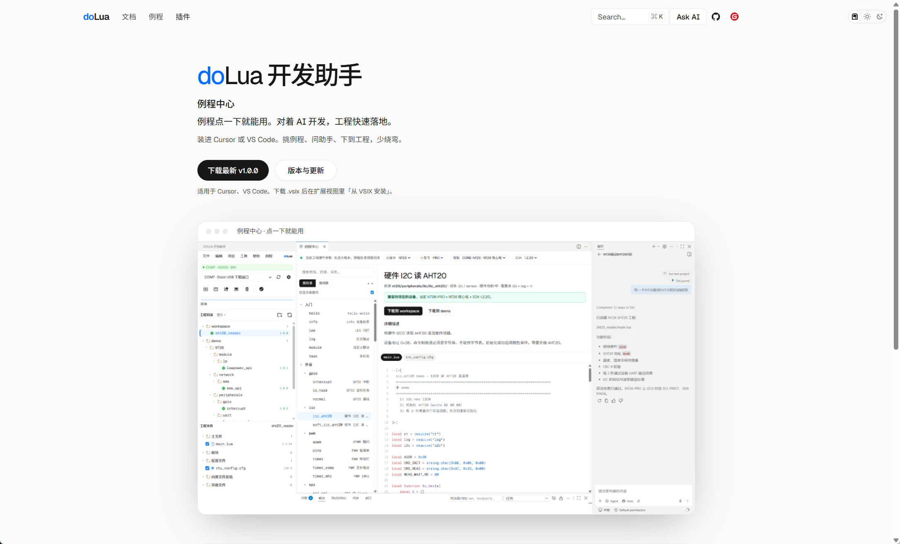

### 3.2 开发工具安装教程

#### 第 1 步：安装编辑器

已有 Cursor / VS Code / Trae 可跳过。三者都能装同一类 VSIX；命令和侧边栏位置略有差别，以你用的那款为准。

#### 第 2 步：安装扩展

安装方式有两种，一种是手动拖放到模块区即可安装。

下方为 vscode 的演示

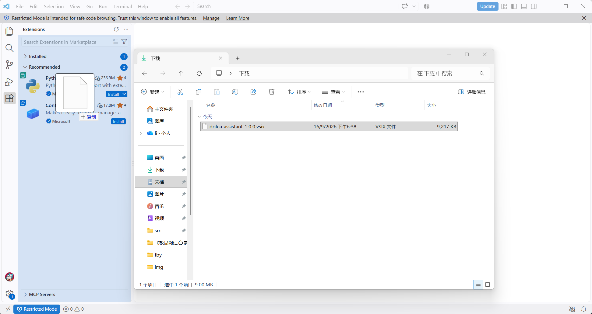

下方为 cursor 的演示

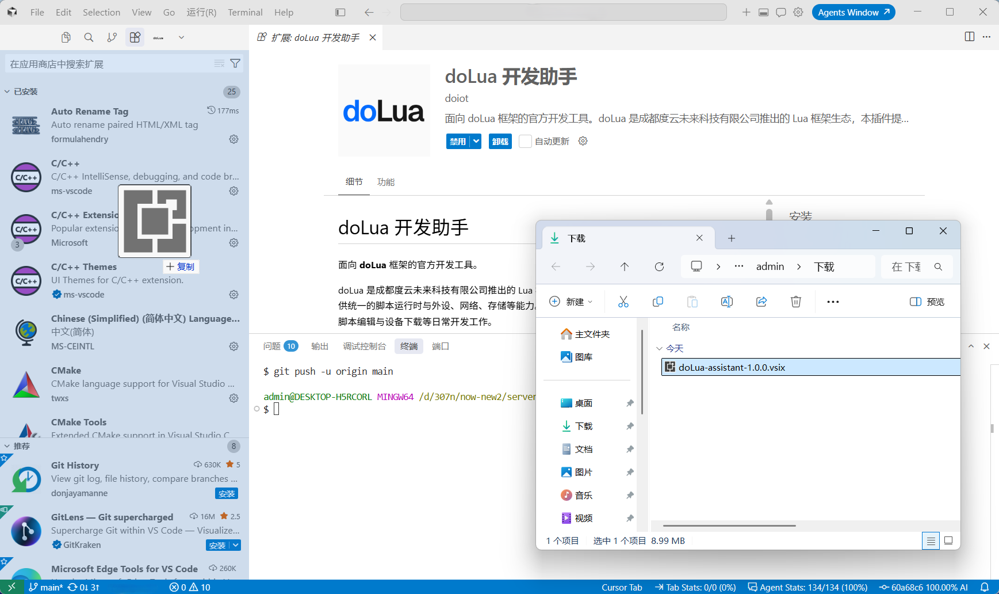

cursor 的布局导致它容易被折叠到下拉栏里，点击展开找到插件，并把它锚定在主界面，然后把左侧栏拉宽一点即可常驻

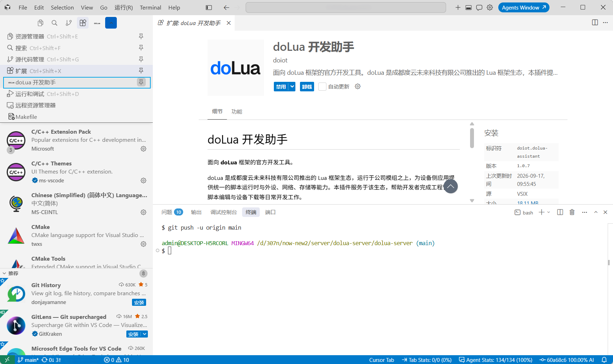

另一种安装方式，如果你已经通过上面的方式安装则可以跳过这段

1. 打开命令面板（Windows：`Ctrl+Shift+P`）。
2. 执行「从 VSIX 安装…」/ `Install from VSIX…`。
3. 选刚下的 `.vsix`，装完后重载窗口。

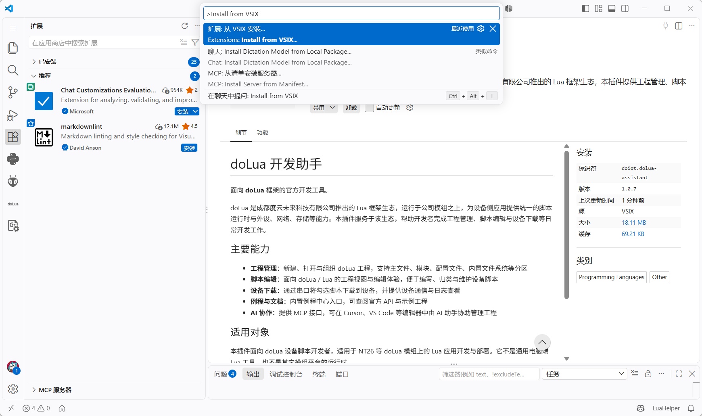

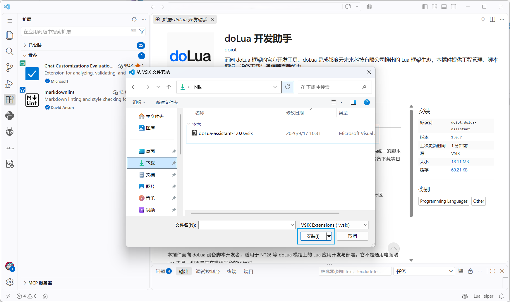

无论你用哪种方式下载，最后都可以找到我们的插件

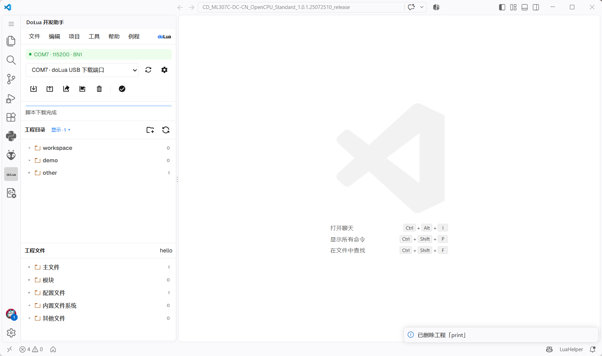

#### 第 3 步：设置 Lua 工作目录

侧边栏的 **Lua workspace**（以及 demo 根）是 **工程仓库**：下面可以放很多个工程，每个工程是单独一层文件夹。这一步是在插件里指定仓库路径，不是让你把整个仓库根当成一份工程，一定不要直接在这个根目录下放工程文件。

可以：../workspace/project/main.lua

不要：../workspace/main.lua

建议：

1. 在磁盘上建一个空目录，例如 `D:\doLua\workspace`。
2. 在侧边栏把 **Lua workspace** 指到这个目录。
3. 需要官方示例时，再设 **demo** 目录（或稍后从例程中心导入）。

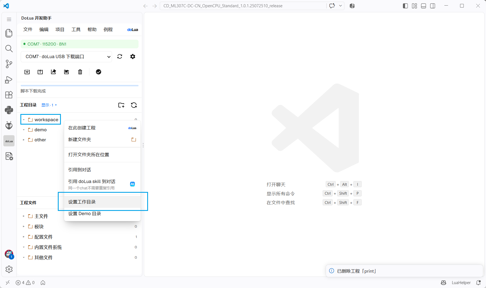

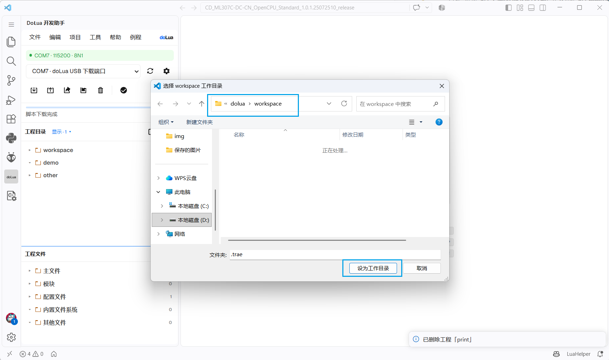

设置完成后，扩展会在该目录写入编辑器所需的助手配置（规则、技能说明等）。工作目录里暂时没有子工程是正常的。

#### 第 4 步：USB 口与 串口

USB 口：

模组用 USB 连上电脑后，设备管理器里通常会出现两路 CDC 虚拟串口（名称以当时固件描述符为准）：

| 口 | 描述符（当前固件） | 干什么 |
| --- | --- | --- |
| USB AT | `doLua USB AT` | 发 AT、看部分日志；也可以切到下载协议下脚本 |
| USB DOWNLOAD | `doLua USB Download` | **专职下 .luapk**，不占 AT 会话 |

注意事项：

- 必须用数据线。口出不来时换线、换 USB 口，模块供电要稳（USB 供电不稳会乱重启）。
- Windows 10/11 一般能直接枚举 CDC。若显示未知设备，按官网驱动说明安装后再看。
- UART 下载另需 USB 转串口接到模组 **UART1**（丝印 `MAIN_TXD` / `MAIN_RXD`，模块 PIN 18 / 17）。出厂波特率常见 **115200 8N1**。
- 不要同时用两路去抢同一轮下载：USB AT、USB DOWNLOAD、UART **同时只允许一路**占用下载引擎。

串口：

设备通常有多路物理串口，需要用户自己使用USB TTL设备连接模块，如果是开发板，则可以使用板载的接口，通常如下：

| 口                   | 描述符                        | 干什么        |
| -------------------- | ----------------------------- | ------------- |
| 连接的设备 MAIN UART | `USB-Enhanced-SERIAL-A CH342` | 发 AT，看 LOG |
| 连接的设备 UART2     | `USB-Enhanced-SERIAL-B CH342` | 发 AT，看 LOG |

建议配置一路物理 UART 作为日志输出，实时性优于 USB。USB 在设备重启时会重新枚举，存在数秒日志断档；物理串口可连续捕获上电日志。doLua `print` /`log` 默认输出到 MAIN UART，支持重定向至其他串口或 USB AT。

### 3.3 构建你的第一个 doLua 工程

下面用最小脚本验证链路

#### 第 1 步：新建工程文件夹

在插件侧边栏对 **workspace** 执行新建工程，文件夹名例如 `print`。插件会在仓库下再创建一层目录，并写入：

```
print/                          ← 工程根（含 luaproj 的这一层）
  doiot_lua_project.luaproj     ← 工程标志，插件只认这个文件
  main.lua                      ← 默认主文件
  rtu_config.cfg                ← 默认配置（可选）
```

不要把 `main.lua` 直接放在 workspace 根目录。

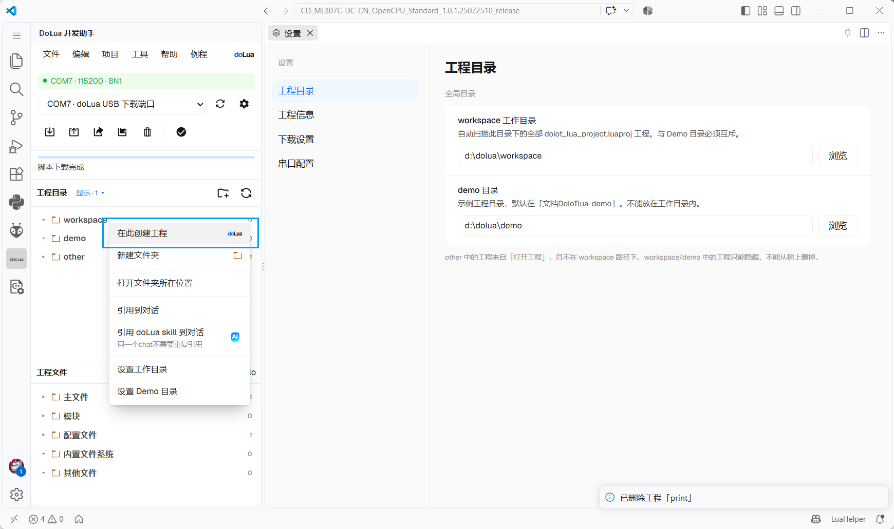

新建工程对话框（文件夹名 `print`）

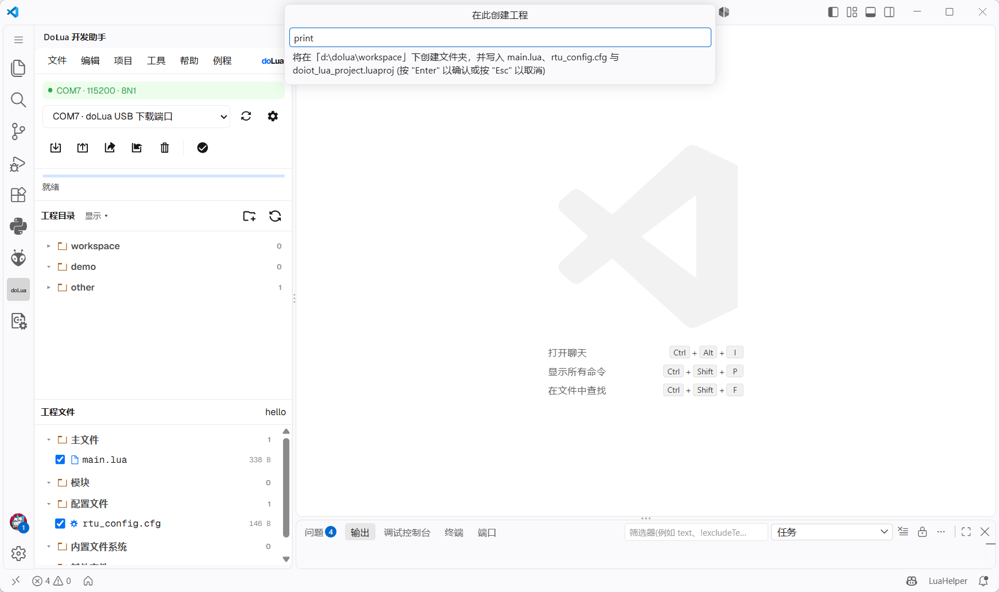

侧边栏出现 `print` 工程，下半`工程文件` 区可以看到`main.lua`和`rtu_config.cfg`

#### 第 2 步：写入口脚本

打开工程里的 `main.lua`，加上一行输出：

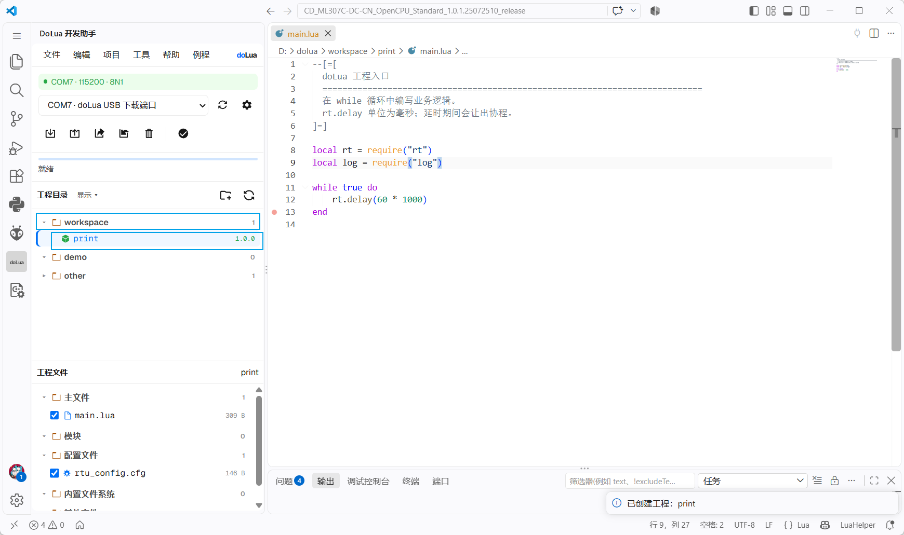

```lua
local rt = require("rt")
local log = require("log")

print("hello world")

while true do
    rt.delay(60 * 1000)
end
```

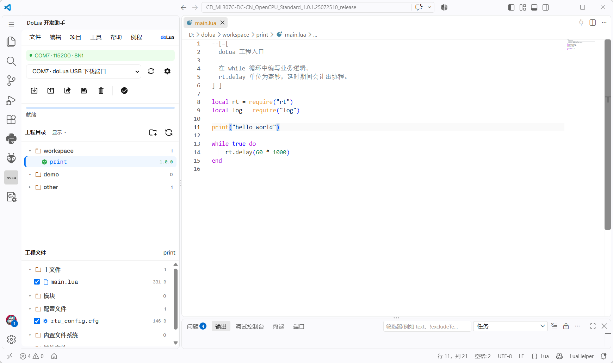

要点：

- `require("rt")` 是平台模块，工程里不用自备 `rt.lua`。
- 入口脚本本身就是一条协程，顶层可以直接 `rt.delay`。
- `rt.delay(60*1000)` 让出 60 秒，其它任务和回调才有机会跑；不要写成从不让出的空转死循环。
- `print` 默认出 **UART1**。若只插了 USB、没接主串口，把配置里的 `print_route` 改成 `usb_at`（见下一步），或用 USB 转串口接 UART1。

`rtu_config.cfg` ：

```ini
[lua]
print_route=uart1
log_route=uart1
```

把 `print` 打到 USB AT 口时改为 `print_route=usb_at`。改配置后要重新下载，复位后生效。

`rtu_config.cfg` ：如果你没有物理串口，只能使用USB看输出

```ini
[lua]
print_route=usb_at
log_route=usb_at
```

如果你本就用的物理串口 MAIN UART 则不用改。

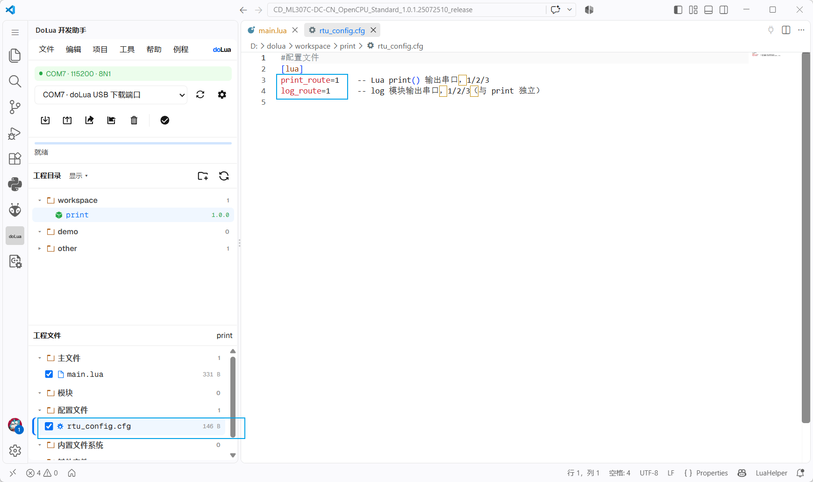

#### 第 3 步：**下载并看输出**

选择下载口，点击下载按钮开始下载

`USB DOWNLOAD` / `USB AT` / `UART COMx`【必须是连接设备的串口】 都是可以作为下载口的。 

以下图为例，使用 USB 下载端口进行下载，点击下载后出现进度条。

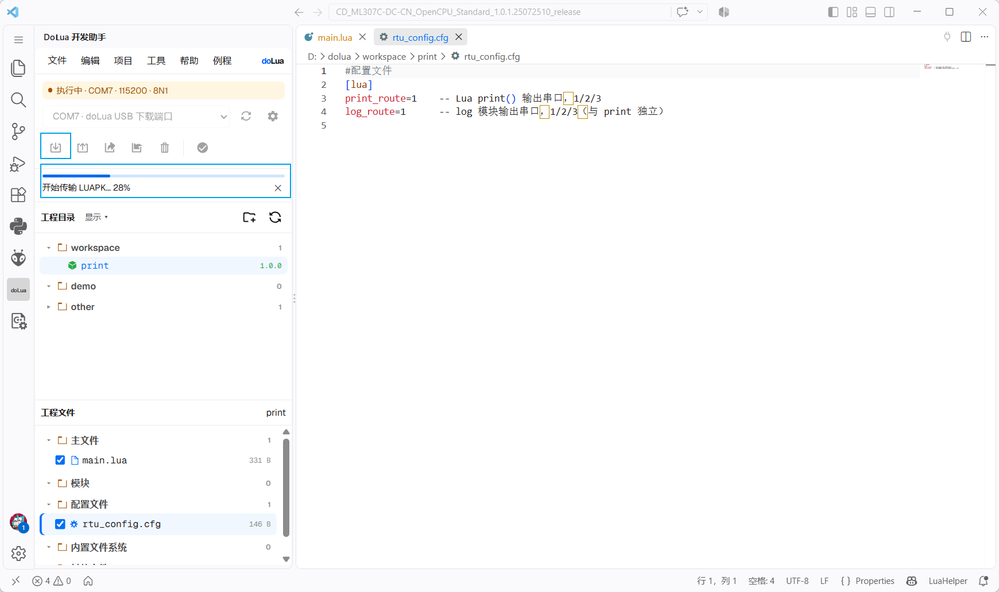

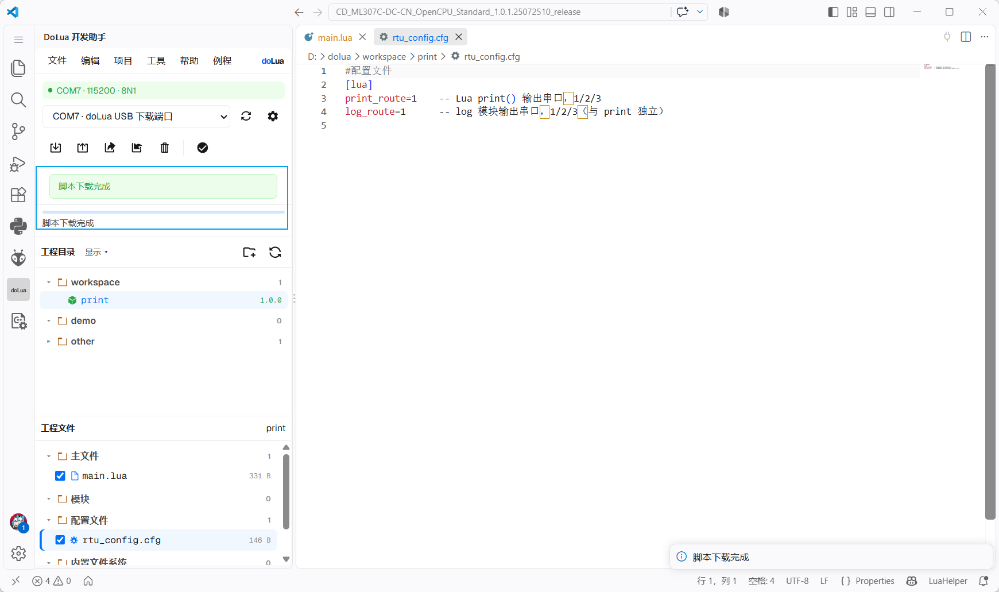

下载完成后会出现提示，之后点击设备的 `reset` 按钮来复位设备，也可以通过串口或者USB AT端口发送指令`AT+RESET` 进行复位，如果 AT 口未通则最好是先把新到的设备发送指令 PING 通，即发送 `AT` 会回复 `OK` 。如果物理串口未通，则后续调试也很难进行，还有就是如果设备因为程序进入无响应状态，又未引出`reset`等情况，则可以给设备断电一阵子，再重新上电即可。

用串口工具打开 **UART1**（115200 8N1）或你配置的 `print_route`，能出现如下 `log`：

```ini

^boot.rom'v  '!\n

ECRDY

+VERSION: "NT26-PRO-RTU-D1.2.27"

+SIM: 2,"READY"

hello world

```

> 关于+VERSION,+SIM 是 RTU 输出，如果不需要是可以用配置进行关闭。

常见问题：

| 现象 | 先查 |
| --- | --- |
| 找不到口 | 线材、供电、驱动、是否进错 USB 口 |
| 下载失败 / 忙碌 | 是否另一路已经在下；关掉占用该 COM 的其它串口助手 |
| 下载成功但没有 `hello world` | `print` 走 UART1，USB AT 上看不到；改 `print_route` 或改接主串口 |
| 乱码 | 波特率不是 115200，或接的是调试口 UART0 却按 UART1 参数开 |
| 脚本没换 | 未复位；或勾选里没有主文件 |

### 3.4 使用例程中心

点击`例程` -> `入门` ->` led` -> `下载到workspace`

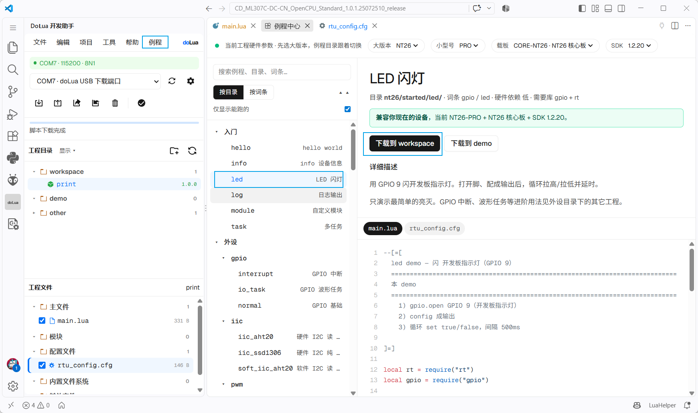

关掉`例程中心`后，双击工程 ` led `或者选中` led` 后点击下方的 `main.lua` 则能展开这个工程的 main 文件。

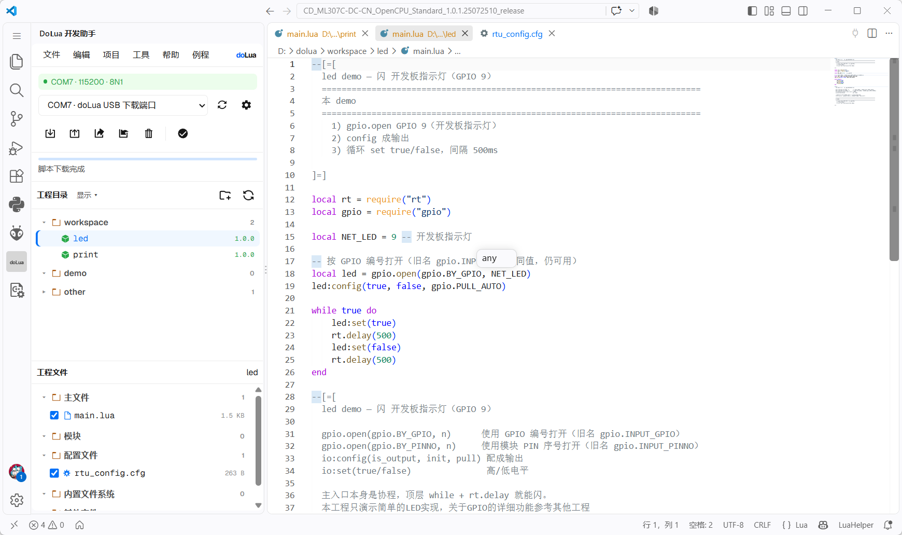

点击下载后，即可看到开发板的 LED 灯在闪烁，示例使用的是 IO 9，如果使用的是其他板，可以根据留出的 IO 自行更换。

---

## 下一步

第一份脚本已经能跑之后，再看这几页：

- [下载与云端](download.md) — USB DOWNLOAD / USB AT / UART / 云平台
- [工程形态](project.md) — 仓库 ≠ 工程、五区、LUAPK
- [开发工具](tools.md) — 侧边栏完整操作
- [调度导读](schedule.md) — 写回调、多任务前再读

[下载与云端 →](download.md)

---

## 读完去哪里

| 接下来 | 去这里 |
| --- | --- |
| 虚拟机、配额、存储怎么分 | [doLua 核心](../nt26/core/README.md) |
| 五区 / LUAPK 细则 | [工程结构](../dolua-assisant/project-structure.md) |
| 查 `require("…")` | [API 索引](../nt26/api/README.md) |
| 对原理图、选脚 | [硬件脚位](../nt26/hardware/README.md) |
| 应用 AT | [AT 索引](../nt26/at/README.md) |
| 抄可烧录工程 | [例程](https://dolua.cn/market) |

---

## 修订记录

| 版本 | 日期 | 说明 |
| --- | --- | --- |
| 1.0.0 | 2026-09-16 | 首版：开始使用（框架、特点、安装与第一份工程、下载通道、工程形态、工具指南、调度导读） |
| 1.0.1 | 2026-09-16 | 插件改为从 https://dolua.cn/plugins 下载 VSIX；标明暂未上架扩展市场 |
| 1.1.0 | 2026-09-17 | 拆成多页：本页只保留快速入门；下载、工程、工具、调度各成一篇 |
